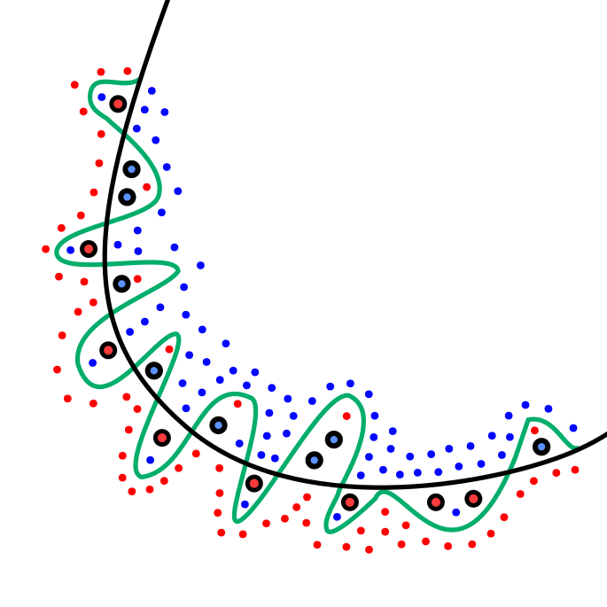
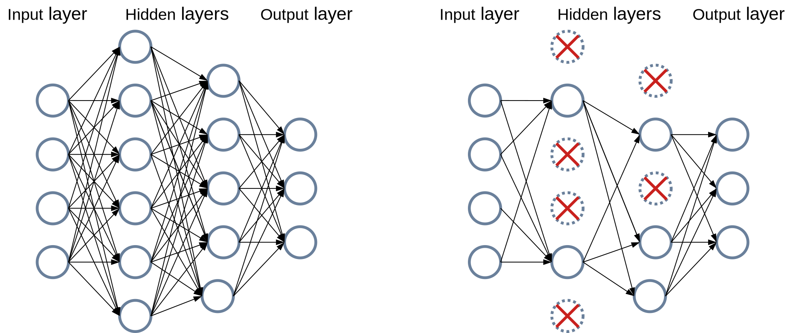

# 01. Machine Learning Overview — 심층 정리

> **이 문서의 목표**
> 단순한 정의 모음이 아니라 "왜 머신러닝이라는 패러다임이 등장했고, 그것이 풀어낸 문제와 새로 만든 문제는 무엇이며, 각 핵심 개념이 어떤 사고의 흐름 속에서 자리 잡는가"를 한 번 읽으면 머리에 남도록 서사로 풀어 쓴다.
> "왜 GD는 작동하는가", "왜 CE를 쓰는가", "왜 validation과 test를 분리하는가" 같은 질문에 1분 답할 수 있게 만드는 것이 우리의 채점 기준이다.

---

## 0. 큰 그림 — ML이라는 패러다임 자체부터 이해하기

### 0.1 사람이 규칙을 못 쓸 때

전통 프로그래밍은 일종의 **삼단 구조**다. 입력이 있고, 사람이 쓴 규칙(rule)이 있고, 그 둘을 결합해 답을 낸다. 회계 시스템, 컴파일러, 데이터베이스 쿼리 옵티마이저 — 이 모든 것은 사람이 도메인 지식을 명시적으로 코드로 변환할 수 있다는 가정 위에 있다.

머신러닝은 이 가정이 깨지는 자리에서 시작한다. **사람이 도무지 규칙을 명시적으로 적을 수 없는 문제들이 있다.** 그 가장 명확한 예가 시각·청각·언어다. 사진 한 장을 보고 "이게 고양이"라고 말하기까지 사람의 뇌에서 일어나는 처리는 의식 수준에서 접근 가능하지 않다. 우리는 답을 알지만 어떻게 그 답에 도달하는지 코드로 옮길 수 없다. 음성을 듣고 단어를 알아내는 것, 자연어 문장의 뜻을 이해하는 것, 의료 영상에서 병변을 찾는 것 — 이런 문제는 "사람이 답을 줄 수는 있지만 규칙을 줄 수는 없다."

머신러닝은 이 비대칭을 활용한다. 규칙을 사람한테 받지 말고, **데이터로부터 함수를 추정**하자. 입력-답 쌍을 충분히 모으면, 그 쌍을 만들어내는 함수 f를 데이터로 근사할 수 있다는 것이 핵심 아이디어다. 다시 말해 머신러닝의 본질은 "**함수 근사 from data**"다.

수학적으로 표현하면 — 우리가 모르는 진짜 함수

$$f^*: \mathcal{X} \to \mathcal{Y}$$

가 어딘가에 있고, 우리는 그 일부 sample을 관찰한다.

$$D = \{(x_i, y_i) \mid i = 1, \ldots, N\}$$

우리가 만들 모델은 파라미터 $\theta$로 매개화된 함수족이며, 학습 데이터의 모든 점에 대해 모델 출력이 정답에 가깝도록 $\theta$를 조정한다.

$$f_\theta(x_i) \approx y_i$$

학습이란 결국 **이 조정 과정** 이고, 좋은 학습이란 본 적 없는 새 입력에 대해서도 다음이 성립하는 것 — 즉 **일반화(generalization)** 가 잘 되는 학습이다.

$$f_\theta(x_{\text{new}}) \approx f^*(x_{\text{new}})$$

### 0.2 ML이 못하는 것

이 패러다임은 만능이 아니다. 몇 가지 본질적 한계가 있다.

첫째, **데이터가 함수를 결정하기에 부족할 때** 작동하지 않는다. 통계학의 기본 명제다. 1차원 입력에서 두 점만 가지고는 직선 외에 어떤 함수도 정할 수 없다. 차원이 높을수록 필요한 데이터는 폭발적으로 증가한다 — 이걸 *curse of dimensionality*라 부른다 (§9에서 자세히).

둘째, **분포가 바뀌면** 학습한 모델은 무력해진다. 의료 영상에서 한 병원 데이터로 학습한 모델을 다른 병원에 가져가면 성능이 종종 급락한다. 사기 탐지 모델은 새 사기 수법이 등장하면 못 잡는다. ML은 "관찰한 분포"를 학습하지 "본질"을 학습하지 않는다 — 이는 ML과 인과추론의 본질적 차이이기도 하다.

셋째, **인과관계를 묻는 질문**에는 약하다. "이 약이 효과 있는가?"는 단순한 상관이 아니라 개입(intervention)의 결과를 묻는다. 관찰 데이터만으로는 confounding을 분리할 수 없고, 무작위 실험(RCT)이나 인과추론 기법이 필요하다. ML은 본질적으로 조건부 확률 $P(Y \mid X)$의 추정 도구이지, 개입 분포 $P(Y \mid \mathrm{do}(X))$의 추정 도구가 아니다.

이 셋을 머리에 두고 가야 면접에서 "ML로 모든 문제 풀 수 있나?"라는 질문에 함정에 빠지지 않는다.

### 0.3 ML, DL, 통계의 관계

흔한 혼동이 ML과 통계의 관계, ML과 딥러닝의 관계다. 깔끔하게 정리하면:

- **통계학**은 **데이터로부터 모집단의 성질을 추정**하는 학문이다. 가설 검정, 신뢰구간, 추정량의 성질이 핵심이다.
- **머신러닝**은 통계학의 도구를 빌려와 **예측을 잘 하는 함수를 만드는 데 초점**을 둔다. 추정량의 일치성보다 test set에서의 실측 성능이 중요하다.
- **딥러닝**은 ML의 한 갈래로, 다층 신경망을 사용하는 ML이다. 핵심 차별점은 **표현 학습(representation learning)** — feature를 사람이 만들지 않고 데이터에서 자동으로 학습한다는 점.

다른 말로, 통계학자는 "이 약이 효과 있는가? 얼마나 확신하는가?"를 묻고, ML 엔지니어는 "이 약이 어떤 환자에게 효과 있을지 예측하는 모델"을 만들고, 딥러닝 연구자는 "그 모델을 환자의 의료 기록과 영상 모두를 입력으로 받게 하려면 어떤 구조가 좋은가"를 답한다. 셋 다 같은 토대 위에 있지만 묻는 질문이 다르다.

### 0.4 왜 지금 딥러닝이 폭발했나 — 세 가지 동시 발전

ML 자체는 1950년대부터 있었지만 딥러닝의 폭발은 2012년 AlexNet 이후다. 왜 그때였나? 면접 단골 질문인데 답이 의외로 단순하다 — **데이터 + 연산 + 알고리즘**의 세 축이 동시에 임계점을 넘었기 때문이다.

- **데이터**: ImageNet (2009)이 1400만 장의 라벨된 이미지를 제공했다. 그 전엔 MNIST(7만 장) 수준에서 놀고 있었다.
- **연산**: GPU의 일반 범용화. NVIDIA CUDA(2007)가 GPGPU 프로그래밍을 가능하게 했고, 행렬 연산이 본질인 딥러닝이 그 위에서 뛰어다녔다.
- **알고리즘**: ReLU, Dropout, 적절한 초기화, BN, ResNet의 skip connection 등 "**깊은 망을 학습 가능하게 만드는 기법들**"이 2010년대에 줄줄이 등장했다.

이 셋 중 하나만 빠져도 딥러닝의 황금기는 오지 못했다. 1990년대에 이미 LeNet 같은 CNN은 있었지만, 데이터와 연산 둘 다 부족해서 작은 영역(우편번호 인식)에 머물렀다.

이 빅 픽처를 잡고 있어야 "딥러닝이 곧 한계에 도달할 것 같은가?"라는 질문에 답할 수 있다 — 답은 "이 세 축 중 어느 하나라도 정체되면 그렇다, 다만 현재는 셋 다 진행 중"이다.

---

## 1. 학습 유형 — 데이터에 어떤 신호가 있는가

ML을 셋(supervised, unsupervised, reinforcement)으로 나누는 분류는 거의 모든 교과서에 나오지만, 이 분류가 **왜 이렇게 되었는지**를 따져 들어가면 한 단계 더 깊은 이해가 된다.

### 1.1 신호의 종류라는 관점

세 유형의 본질적 차이는 **모델이 받는 학습 신호의 종류**다.

**Supervised learning**에서는 각 입력에 정답이 짝지어져 있다. $(x_i, y_i)$ 쌍이 주어진다. 학습 신호가 **강하다** — "이 입력의 정답은 이거"라고 직접 알려준다. 분류와 회귀가 여기 속한다. 영상에서 객체 인식, 음성에서 텍스트 변환, 텍스트 분류 — 우리가 일상에서 쓰는 ML 응용의 대부분.

**Unsupervised learning**은 정답이 없다. 입력 $x_i$만 주어진다. 신호가 **약하다** — 모델이 데이터 자체의 구조를 발견해야 한다. 군집(clustering), 차원 축소(PCA, t-SNE, UMAP), 밀도 추정, 생성 모델(VAE, GAN, Diffusion) 등이 여기 속한다. "이 사진들 사이에 어떤 관계가 있는지 찾아내라"는 식이다.

**Reinforcement learning**에서는 환경과 상호작용한다. 에이전트가 행동을 하면 보상을 받는데, 이 보상이 **희박하고(sparse), 지연되어(delayed)** 도착한다. 알파고가 바둑을 둘 때, 한 수마다 보상이 오는 게 아니라 게임이 끝날 때 단 한 번 +1/-1이 온다. 그 한 번의 신호로 **수많은 결정이 좋았는지 나빴는지를 역추적**해야 한다. 그래서 RL은 학습이 어렵고 sample-inefficient하다.

이 세 분류는 **우주의 진리**가 아니라 신호의 종류로 만든 분류다. 그래서 모서리에 다양한 변종이 있다.

### 1.2 변종들 — 현실은 더 복잡하다

**Semi-supervised learning**: 라벨이 일부에만 있는 경우. 이미지 100만 장 중 1만 장만 라벨됨. 라벨된 데이터로 supervised 학습하면서 라벨 없는 데이터의 분포 정보도 활용한다. 라벨링 비용이 비싼 의료·법률 분야에서 중요하다.

**Self-supervised learning**: 입력 자체에서 라벨을 자동으로 만드는 방법. BERT는 문장의 일부 단어를 가리고 모델이 그 단어를 맞히게 한다 (masked language modeling). SimCLR은 같은 이미지의 다른 augmentation 두 개를 "같은 것"으로 학습시킨다. 라벨이 사실상 무한히 생기므로 매우 큰 데이터로 사전학습이 가능하다 — 이게 GPT/BERT 식 foundation model의 토대다.

**Weakly supervised learning**: 라벨이 정확하지 않거나(noisy) 거칠다(coarse). 이미지 분류 라벨이 30% 틀렸거나, 영상 단위 라벨로 픽셀 segmentation을 학습하려는 경우.

**Active learning**: 모델이 "이 sample을 라벨링해 주세요"라고 요청한다. 라벨링 예산이 한정적일 때 중요한 sample만 골라 라벨링.

면접에서 "self-supervised이 supervised보다 좋은가?"라는 질문이 나오면 답은 "다른 자리"다. Self-supervised는 라벨 없는 대량 데이터로 좋은 표현을 만드는 사전학습 단계, supervised는 그 표현 위에 작은 라벨된 데이터로 fine-tuning. 둘은 보완적이지 대체재가 아니다.

### 1.3 supervised 안에서: 분류 vs 회귀의 본질

분류와 회귀는 출력의 종류로 구분된다. 분류는 이산 클래스, 회귀는 연속 실수. 단순해 보이지만 **여기서 모델 설계의 거의 모든 결정이 달라진다.**

**출력층이 다르다.** 회귀는 마지막을 그대로 두지만 (linear), 이진 분류는 sigmoid로 0–1 확률을, 다중 분류는 softmax로 클래스별 확률 분포를 낸다. 왜 그런가?

답은 **확률적 해석**에 있다. 분류는 "각 클래스일 확률"을 출력해야 하는데, 모델이 임의의 실수를 내면 확률이 안 된다. Sigmoid는 임의 실수를 (0, 1)로 보내고, softmax는 임의 벡터를 합이 1인 확률 분포로 보낸다. 이 변환은 단순한 정규화가 아니라 **maximum likelihood estimation의 자연스러운 출력 형태**다 (loss 챕터에서 다시 본다).

**Loss가 다르다.** 회귀에서는 MSE/MAE/Huber, 분류에서는 cross-entropy. 왜 분류에 MSE를 쓰면 안 되는가? 두 가지 이유가 있다.

첫째, MSE + softmax 조합은 **gradient가 작다**. Softmax의 출력 영역에서 큰 영역이 포화(saturation)이고, 그 영역에서 미분이 0에 가깝다. MSE의 gradient에는 이 미분이 곱해지므로, 모델이 매우 자신 있게 틀려도 gradient가 거의 안 흐른다. 학습이 안 된다.

둘째, CE는 확률적으로 **MLE와 등가**다. 분류의 자연스러운 확률 모델 (categorical distribution) 아래에서 negative log-likelihood가 정확히 cross-entropy다. 그래서 CE는 통계적으로 "옳은" 선택이고, MSE는 그렇지 않다.

**평가 metric이 다르다.** 회귀는 RMSE/MAE/R² 같은 절대 오차 기반, 분류는 accuracy/precision/recall/F1/AUC 같은 비율 기반 — 게다가 클래스 불균형이 있으면 accuracy도 무의미하다 (§8에서 자세히).

### 1.4 분류와 회귀의 교차로 — 순위(ranking)와 분포 예측

현실에는 분류와 회귀의 교차로에 있는 task들이 있다.

**순위 예측(ranking)**: 검색 엔진에서 결과를 순서대로 매기기, 추천 시스템에서 좋아할 것 같은 영화를 정렬하기. 출력이 클래스도 아니고 정확한 점수도 필요 없다 — **순서**만 맞으면 된다. Pairwise loss(BPR), listwise loss(LambdaRank, ListNet) 같은 특수 loss를 쓴다.

**분포 예측(distributional regression)**: 단일 점값이 아니라 분포를 예측. 일기예보가 "내일 비올 확률 70%"라고 할 때, 그 확률 자체가 출력이다. Mixture density network, Bayesian neural network이 여기 속한다.

**Multi-label**: 한 입력에 여러 라벨이 동시에. 이미지 한 장에 "고양이", "실내", "장난감" 셋 다 있을 수 있다. Softmax는 안 되고(합이 1) 클래스마다 sigmoid + BCE를 따로.

이런 것들이 "분류 아니면 회귀"라는 이분법에 안 맞아서 종종 처음 보면 당황한다. 그래도 본질은 같다 — **모델은 함수를 근사하고, loss는 그 함수가 얼마나 틀렸는지를 정량화한다.**

---

## 2. Loss Function — 학습이 가능하려면 무엇이 필요한가

Loss는 ML의 심장이다. Loss가 정의되지 않으면 학습이라는 행위 자체가 정의되지 않는다.

### 2.1 Loss의 본질 — "현재 예측이 얼마나 나쁜가"

Loss function $L(y, \hat{y})$는 정답 $y$와 예측 $\hat{y}$를 받아 스칼라를 낸다. 작을수록 좋다. 학습은 $L$의 평균(empirical risk)을 minimize한다:

$$\mathcal{L}(\theta) = \frac{1}{N} \sum_{i=1}^N L(y_i, f_\theta(x_i))$$

여기서 우리는 두 가지 가정을 깔고 있다. 첫째, **L이 미분 가능해야 한다** — 그래야 gradient descent로 최적화한다. 둘째, **L의 최소값이 진짜 좋은 모델에 대응해야 한다** — 즉 loss를 줄이는 것이 우리가 원하는 행동(좋은 예측)과 같은 방향이어야 한다.

이 두 조건이 자명해 보이지만, 실제로 깨지는 경우가 많다. 분류의 0-1 loss(틀린 비율)는 **미분 불가능**해서 직접 최적화 못한다. 그래서 미분 가능한 surrogate (대리) loss인 cross-entropy를 쓴다. CE를 줄이는 것이 0-1 loss를 줄이는 것과 거의 같은 방향이다 — 거의 같지, 정확히 같진 않다 (이게 calibration 문제로 이어진다).

### 2.2 회귀 loss — MSE, MAE, Huber의 사고 흐름

회귀 loss는 잔차 $r_i = y_i - \hat{y}_i$를 **어떤 도형으로 만들어 합치느냐**의 차이다 — MSE는 정사각형의 면적, MAE는 직선의 길이, Huber는 둘의 절충. → **시각적 직관 + 정사각형 면적으로 보기**: [topics/regression_loss/01_geometry.md](topics/regression_loss/01_geometry.md).

**MSE (Mean Squared Error)**: $L = \frac{1}{N} \sum (y_i - \hat{y}_i)^2$. 잔차를 *제곱*해서 더한다.

- *왜 쓰는가*: 가우시안 noise 가정 아래의 MLE($y = f(x) + \epsilon, \epsilon \sim \mathcal{N}(0, \sigma^2)$이면 NLL이 정확히 MSE에 비례). 즉 *loss 선택은 noise 모델의 표명*이다 — MSE = "잔차가 정규분포일 거라 믿는다".
- *장점*: 미분 가능, hessian 정의됨, 최적화 이론 깔끔.
- *단점*: **이상치에 매우 민감**. 오차 10인 한 점이 오차 1인 점 100개와 같은 영향(제곱이라 정사각형 면적이 100배). 가우시안 가정이 깨지면 학습이 outlier에 끌려간다.

**MAE (Mean Absolute Error)**: $L = \frac{1}{N} \sum |y_i - \hat{y}_i|$. 잔차의 *절댓값*을 더한다.

- *왜 쓰는가*: 라플라스 noise 가정 아래의 MLE. 이상치에 **robust** (잔차 영향이 선형이라 outlier가 정사각형이 아니라 직선만큼만).
- *단점*: 0에서 미분 불가능 → 학습 동역학 부드럽지 않음. minimizer가 평균이 아니라 중앙값이라 분포 모양에 따라 평균과 다른 곳을 학습.

**Huber loss**: MSE와 MAE의 절충. $|r| \le \delta$이면 MSE처럼, $|r| > \delta$이면 MAE처럼.

$$
L_\delta(y, \hat{y}) =
\begin{cases}
\tfrac{1}{2}(y - \hat{y})^2 & \text{if } |y - \hat{y}| \le \delta \\[2pt]
\delta |y - \hat{y}| - \tfrac{1}{2}\delta^2 & \text{otherwise}
\end{cases}
$$

작은 오차엔 부드러움(MSE), 큰 오차엔 robust(MAE). 실무 default로 자주. $\delta$는 hyperparameter — *default 1.0*. 표준값·튜닝은 [hyperparameters/loss.md#huber-δ](topics/hyperparameters/loss.md#huber-δ), 시각적 직관(loss curve, 잔차 도형)은 [topics/regression_loss/01_geometry.md](topics/regression_loss/01_geometry.md#1.4-huber).

"**가우시안 가정이 합리적**"이라는 건 잔차가 종 모양·대칭, outlier 드묾이라는 뜻 — 측정 오차의 합 같은 *여러 독립 요인의 합*은 CLT로 자연히 정규에 수렴. 반대로 fat tail / skewed면 가정이 깨진 것 → MAE/Huber로.

**언제 무엇을 쓰는가?**
- 데이터가 깨끗하고 가우시안 가정 합리적 (잔차가 종 모양·대칭, outlier 드묾) → MSE
- 이상치 多, robust 원함 → MAE 또는 Huber
- 의심스러우면 → Huber (보통 default)

### 2.3 분류 loss — Cross-Entropy의 본질

분류에서 cross-entropy의 자리는 압도적이다. MSE를 시도해 본 사람들은 대부분 학습이 안 되어 CE로 돌아왔다. 왜?

**확률적 해석**: 분류 모델의 출력에서 클래스 $c$에 부여된 확률을 $\hat{y}_c$로 적자. 정답 클래스를 $c^*$라 하면 likelihood는 정답 클래스에 부여된 예측 확률

$$\hat{y}_{c^*}$$

이고, 이를 최대화하는 것이 negative log-likelihood를 최소화하는 것이며, 이게 정확히 cross-entropy다:

$$L_{CE} = -\sum_c y_c \log \hat{y}_c$$

여기서 $y_c$는 클래스 $c$의 정답 분포(보통 one-hot이지만 label smoothing하면 부드러움)다.

그리고 $\hat{y}_c$는 모델이 출력한 클래스 $c$의 예측 확률이다.

**Softmax + CE의 마법 — gradient가 깨끗하다.** 마지막 layer의 logit을 $z$, softmax 출력을 $\hat{y}$라 하자. Logit에 대한 CE의 gradient를 직접 계산하면 (체인 룰):

$$\frac{\partial L_{CE}}{\partial z_c} = \hat{y}_c - y_c$$

놀랍게도 너무 깔끔하다. "예측 확률 - 정답 확률". 모든 saturation 항(softmax의 미분)이 정확히 상쇄되어 사라진다. 이래서 softmax + CE 조합이 깊은 망에서도 gradient가 잘 흐른다. MSE + softmax는 이 상쇄가 안 일어나서 망가진다.

**이진 분류에서**: 출력이 sigmoid 한 개고, BCE (Binary Cross-Entropy) loss:

$$L_{BCE} = -[y \log \hat{y} + (1-y) \log(1-\hat{y})]$$

여기서도 gradient가 $\hat{y} - y$로 깨끗하다.

**KL divergence와의 관계**: $D_{KL}(p \,\|\, q) = \sum p \log(p/q) = \sum p \log p - \sum p \log q$. 첫 항은 $p$만의 함수니까 $q$에 대한 gradient에는 안 나타난다. 즉 KL의 $q$에 대한 gradient는 cross-entropy와 같다. 그래서 cross-entropy를 minimize하는 것 = KL divergence를 minimize하는 것. 정답 분포와 예측 분포의 거리를 줄이는 작업이다.

### 2.4 변종들 — Focal, Label Smoothing, Triplet

**Focal Loss**: 클래스 불균형에 강한 분류 loss. 쉽게 맞히는 sample에 가중치를 줄이고 어려운 sample에 집중한다.

$$L_{focal} = -(1 - \hat{y})^\gamma \log \hat{y}$$

$\gamma > 0$이면 $\hat{y}$가 1에 가까운 (이미 잘 맞힌) sample은 $(1-\hat{y})^\gamma \approx 0$으로 거의 무시된다. 어려운 sample만 학습. 의료 이미지의 병변 segmentation, 객체 검출의 background 비율이 99%인 상황에 효과적.

*Default $\gamma = 2$* (RetinaNet). γ↑이면 어려운 sample에 강하게 집중, 라벨 noise 많으면 γ↓. → [hyperparameters/loss.md#focal-γ](topics/hyperparameters/loss.md#focal-γ).

**Label Smoothing**: 정답을 one-hot 대신 약간 smooth하게. 정답 클래스에 0.9, 나머지에 0.1/(K-1)씩.

$$
y_c =
\begin{cases}
1 - \alpha & \text{if } c = c^* \\[2pt]
\alpha/(K-1) & \text{otherwise}
\end{cases}
$$

왜? Hard one-hot을 학습하면 모델이 **과신(overconfident)**한다 — 정답에 99.99% 확률, 나머지에 0.001%. 이는 calibration이 안 좋고 일반화도 약간 손해. Label smoothing은 모델이 "100%는 절대 없다"를 학습하게 해 더 robust해진다. 큰 모델 + 큰 데이터에서 자주 쓴다.

*Default $\alpha = 0.1$* (NMT/ImageNet 표준). 라벨 noise 의심 시 0.2까지, knowledge distillation과 충돌 주의. → [hyperparameters/loss.md#label-smoothing-α](topics/hyperparameters/loss.md#label-smoothing-α).

**Triplet Loss**: 메트릭 학습용. (anchor, positive, negative) 셋을 받아 anchor-positive 거리는 가깝게, anchor-negative 거리는 멀게.

$$L_{triplet} = \max(0, d(a, p) - d(a, n) + \text{margin})$$

얼굴 인식(FaceNet), 검색 등에서 쓴다. 클래스 분류보다 "얼마나 가깝냐"가 중요한 task.

*Default margin = 0.2* (FaceNet, 정규화 임베딩 기준). semi-hard mining이 표준. → [hyperparameters/loss.md#triplet-margin](topics/hyperparameters/loss.md#triplet-margin).

**Contrastive Loss**: SimCLR식 자기지도 학습의 기둥. 같은 sample의 두 augmentation은 가깝게, 다른 sample은 멀게. NT-Xent (normalized temperature-scaled cross entropy) loss 가 표준 form. *Default temperature $\tau = 0.1$* (SimCLR) — batch size에 묶여 변동. → [hyperparameters/loss.md#contrastive-temperature-τ](topics/hyperparameters/loss.md#contrastive-temperature-τ).

### 2.5 Loss를 고를 때의 사고 흐름

1. **Task 종류** 결정 — 분류/회귀/순위/메트릭 학습?
2. **출력 분포 가정** — 가우시안? 라플라스? 카테고리?
3. **데이터 특성** — 이상치 있나? 클래스 불균형? 라벨 noise?
4. **출력층** — Loss와 짝이 맞는가? (Sigmoid+BCE, Softmax+CE, Linear+MSE)
5. **gradient 흐름** — 큰 saturation 영역에서 학습이 죽지 않는가?

이 다섯을 의식적으로 답할 수 있으면 loss 선택은 거의 자동이다.

---

## 3. Gradient Descent — 왜 작동하고 언제 안 되는가

GD는 ML의 작업장이다. 거의 모든 신경망 학습이 GD의 변종으로 굴러간다. 왜 작동하는지, 언제 안 되는지를 분명히 알아야 한다.

### 3.1 왜 음의 gradient 방향인가

Loss $L(\theta)$는 보통 파라미터 수만큼 차원이 큰 비선형 함수다. 전체 모양을 한 번에 그려볼 수도, 닫힌 형태로 minimum을 풀어 낼 수도 없다. 그래서 GD는 다른 전략을 쓴다 — **한 점 근처에서는 함수가 잠깐 평면처럼 보인다**는 사실을 이용한다.

"평면처럼 보인다"가 무슨 말인가. **지구 표면**이 좋은 비유다. 지구는 둥글지만 우리가 한 발짝 걷는 동안에는 평지처럼 느껴진다 — 한 발 거리 안에서는 지구의 곡률이 무시할 만큼 작기 때문. "지금 여기서 어느 쪽이 내리막이냐"는 질문에는 평면 가정으로 충분하고, 곡률은 멀리 갈 때만 문제가 된다.

매끄러운 함수도 같은 성질을 가진다. 한 점 근처의 충분히 작은 영역 안에서는 함수의 곡률(2차 이상 항)이 거의 사라져, 함수가 직선(1D)·평면(2D)·hyperplane(고차원)처럼 행동한다. 이게 사실 **미분의 정의 그 자체**다 — *그 점 근처의 함수를 가장 잘 흉내 내는 직선·평면의 기울기*가 곧 gradient.

**그럼 왜 평면이 중요한가?** 비선형 함수의 minimum을 직접 푸는 건 일반적으로 매우 어렵다 — 산 전체 지도를 들고 "최저점이 어디냐"를 푸는 일과 같다. 그러나 평면 위에서 "어디가 가장 빠른 내리막이냐?"는 답이 뻔하다 — gradient의 정반대 방향 한 가지뿐. 평면이라는 단순화가 *수학적으로 풀기 쉬워지는 게 핵심*이다.

그래서 **GD는 어려운 비선형 minimization을 작은 평면 minimization 수만 번으로 쪼개 푸는 알고리즘**이다. 현재 점에서 평면을 그리고, 가장 빠른 내리막으로 살짝 가고, 새 위치에서 다시 평면을 그리고, 또 살짝 가고… 반복. 발 밑만 보고 산을 내려가는 등산객의 전략과 정확히 같다.


> *서로 다른 세 시작점에서 출발한 GD가 같은 minimum으로 수렴하는 모습. 한 step씩 음의 gradient 방향으로 내려간다. 시작점에 따라 경로는 달라도 도착지는 같다 (이 함수가 단일 minimum이라 그렇고, 실제 신경망은 minimum이 여러 개라 시작점/seed에 따라 결과가 달라짐).*  
> *Source: [Wikimedia Commons](https://commons.wikimedia.org/wiki/File:Gradient_descent.gif), Jacopo Bertolotti, CC0.*

이를 수학으로 정확히 표현한 것이 **Taylor 전개**다. 매끄러운 함수라면 임의의 점 $\theta_0$ 근처에서 다음과 같이 근사된다.

$$L(\theta_0 + \delta) \approx L(\theta_0) + \nabla L(\theta_0)^T \delta$$

여기서 $\nabla L(\theta_0)$가 그 점에서의 gradient(평면의 기울기), $\delta$가 한 step의 변위. 작은 $\delta$ 안에서는 우변(1차 평면)이 좌변(실제 비선형 함수)과 거의 일치한다 — 위 등산 비유 그대로다.

그럼 어느 방향이 가장 빨리 내려가는가? $\delta = -\eta \nabla L(\theta_0)$로 놓으면:

$$L(\theta_0 + \delta) \approx L(\theta_0) - \eta \|\nabla L(\theta_0)\|^2 \le L(\theta_0)$$

즉 **음의 gradient 방향이 1차 근사에서 가장 빨리 감소하는 방향**이다. 코쉬-슈바르츠 부등식으로 $\nabla L^T \delta \ge -\|\nabla L\| \|\delta\|$이고 등호는 $\delta$가 $-\nabla L$ 방향일 때 성립.

비밀은 없다 — **함수를 1차 근사하고 그 방향으로 살짝 움직인다**. 단순함이 그 강함이다.

**곁가지 — 왜 1차만? 2차는 Newton's method다.** 2차 Taylor까지 쓰면 update가 $\delta = -H^{-1}\nabla L$ 형태(H는 hessian)가 되어 곡률을 반영한 더 빠른 수렴(이차 수렴)이 보장된다. 근데 수십억 파라미터 신경망에서 hessian을 저장하고 역행렬을 푸는 건 사실상 불가능하다. 그래서 신경망에서는 1차 GD가 표준이고, Adam·RMSProp 같은 adaptive optimizer가 *대각 hessian의 근사*를 통해 약간의 2차 정보를 흉내 내는 정도에 그친다 (§3.6).

### 3.2 step size (learning rate)의 역할

위에서 작은 $\eta$를 가정했다. 너무 크면 1차 근사가 깨지고, 너무 작으면 진전이 없다. 이게 LR(learning rate) 선택의 핵심이다.

$\eta$가 너무 크면: 곡률이 큰 곳에서 1차 근사가 무의미해지고 update가 발산한다. Loss가 NaN으로 폭발하거나 진동한다. 깊은 망에서는 BN 통계도 흔들리고 활성값 분포가 깨진다.

$\eta$가 너무 작으면: 진전이 거의 없거나 너무 느리다. 또 saddle point나 평탄 영역에 머물 위험.

**경험칙**: $\eta$는 가장 민감한 hyperparameter다. 학습 결과는 모델 구조보다 LR에 더 민감한 경우가 많다.

### 3.3 변종들 — batch, mini-batch, SGD

전체 데이터를 한 번에 다 보고 gradient를 구해 update하는 게 **batch GD**(또는 *full-batch GD*). 한 step의 update는 모든 sample의 gradient를 평균 낸 것이다.

$$\theta_{t+1} = \theta_t - \eta \cdot \frac{1}{N} \sum_{i=1}^N \nabla L_i(\theta_t)$$

여기서 $L_i$는 $i$번째 sample의 loss, $N$은 전체 sample 수. 평균이 들어가 있어 *진짜 gradient*를 정확히 계산하는 셈이다.

**장점**

- *정확한 방향*: gradient에 stochastic noise가 없으니 매 step이 정확히 가장 가파른 내리막. 같은 데이터·초깃값이면 결과가 결정론적이라 디버깅·재현이 깔끔하다.
- *수렴 안정성*: 같은 LR에서 SGD가 minimum 주변을 zigzag로 떠돌 때 batch GD는 정확히 정착한다. LR decay가 필수가 아니다.
- *이론적 분석이 깔끔*: convex case의 수렴 보장, step size 분석이 닫힌 형태로 떨어진다. 학부 최적화 교과서가 보통 이 모델을 가정.

**단점 — 그리고 이게 신경망 시대에 batch GD가 안 쓰이는 이유**

- *연산 비용*: 한 step에 N개 sample 전부 forward + backward를 돌려야 한다. ImageNet의 1.4M장을 한 step에 다 통과시키는 건 비현실적.
- *메모리*: 데이터셋 + 모든 forward activation을 메모리에 올려야 한다. GPU 한 장으론 못 담는 데이터셋이 부지기수다.
- *update가 드묾*: 한 epoch에 단 한 번 update. 100 epoch을 돌려도 step이 100번뿐이라 학습 진척이 매우 더디다. 같은 시간에 SGD는 수만 번 update.
- *online learning 불가*: 데이터가 스트림으로 들어오는 환경에선 작동 못함. 추천·광고처럼 분포가 계속 바뀌는 곳에선 치명적.
- *sharp minima로 빠지기 쉬움*: gradient에 noise가 없으니 좁고 가파른 minimum 안으로 정확히 미끄러진다. 그 minimum이 일반화가 약하면 그대로 갇힌다 (§4.4 double descent와 연결).
- *고차원 saddle에서 stuck*: gradient를 정확히 계산하는 것의 부작용. saddle point에서 gradient가 정확히 0에 가까워 빠져나갈 push가 없다 (§3.4의 saddle GIF에서 SGD가 noise 덕에 결국 탈출하는 모습과 정반대).

**언제 batch GD를 쓰는가?**

신경망 학습에선 거의 안 쓴다. 데이터셋이 매우 작거나(<수백 개), 재현성 검증이 중요한 연구·디버깅 환경에서만 가끔. 학부 강의에서는 *수학적으로 깔끔해서* 자주 등장하지만, 실무에서 마주칠 일은 드물다 — 마주치는 건 거의 항상 *mini-batch SGD*(아래)다.

**SGD (Stochastic GD)**: 매 step 데이터셋에서 무작위로 sample 하나만 골라 그 점에서의 gradient를 계산하고 update한다. update 식은 batch GD와 거의 같지만 평균이 빠진다.

$$\theta_{t+1} = \theta_t - \eta \nabla L_i(\theta_t) \quad (i\text{는 매 step 무작위 sample})$$

batch GD가 모든 sample의 평균 gradient $\frac{1}{N}\sum_{i=1}^N \nabla L_i$를 매 step 계산했다면, SGD는 그 평균을 **한 sample로 거칠게 추정**한다. "stochastic(확률적)"이라 부르는 이유는 매 step의 gradient가 *어떤 sample을 뽑았느냐*에 따라 흔들리는 random variable이기 때문이다. 다행히 모든 sample 위에서 *평균* 내면 batch GD의 진짜 gradient와 같다 — 통계 용어로 **unbiased estimate**. 즉 long run으로는 batch GD와 같은 방향으로 간다.

**장점**

- *연산 비용*: 한 step에 한 sample만 보면 되니 매우 싸다. batch GD가 한 step 만들 시간에 SGD는 N번 step을 만든다 — *같은 시간 안에 N배의 update*.
- *메모리*: 한 sample만 올리면 되니 데이터셋이 GPU·RAM에 안 들어가도 학습 가능.
- *online learning*: 데이터가 스트림으로 흘러들어오는 상황(추천 시스템, 광고 등)에 그대로 적용 가능. batch GD는 이게 안 된다.

**단점**

- *분산이 크다*: 한 sample의 gradient는 진짜 gradient에서 멀리 벗어날 수 있어 update 방향이 매 step 들쭉날쭉. 수렴 경로가 zigzag로 그려진다.
- *수렴 불안정*: 같은 LR에서 batch GD가 minimum에 정착할 때 SGD는 그 주변을 계속 떠돈다. 안정 수렴을 보장하려면 LR을 점차 감소시켜야 한다 (Robbins-Monro 조건: $\sum \eta_t = \infty, \sum \eta_t^2 < \infty$ — *충분히 큰 합으로 어디든 갈 수 있되, 제곱 합은 유한해서 결국 멈춘다*).

**그런데 noise가 양날의 칼이다** — 단점이 곧 장점이 되는 지점이 있다.

- *saddle point 탈출*: 고차원에서 매우 흔한 saddle point에서 batch GD는 gradient가 0에 가까워 stuck되지만, SGD의 random noise는 평형점을 슬쩍 흔들어 탈출시킨다. (위 §3.4 saddle 그림에서 SGD가 결국 탈출하는 게 이 효과.)
- *sharp minima 회피*: 너무 좁고 가파른 minimum은 일반화가 약한 경향이 있다(§4.4 double descent와 연결). SGD의 noise는 그런 minimum 안에 머물지 못하게 해 부드러운(flat) minimum으로 이동시킨다 — *암묵적 정규화*의 한 형태.
- *batch GD의 단점은 noise가 없어서다*: 위 §3.3 첫 단락에서 batch GD가 sharp minima로 빠지기 쉽다고 한 게 이 맥락이다. SGD의 zigzag가 단순한 부작용이 아니라 일반화에 도움이 된다는 것.

**실무 표기 주의**: 논문·코드에서 "SGD"라고 부르면 거의 항상 아래의 *mini-batch SGD*를 가리킨다. 순수 sample-한-개짜리 SGD는 GPU 병렬을 활용 못해서 실무에서 거의 안 쓴다. PyTorch의 `torch.optim.SGD`도 호출 시 batch 단위로 작동하므로 사실은 mini-batch SGD다. 이름과 실제가 어긋나는 흔한 함정.

**Mini-batch SGD**: 32–512개씩. 둘의 절충. GPU에서 병렬 잘 돌고, noise가 적당히 있어 일반화 좋고, 표준 선택이 됐다.

배치 크기에 대한 핵심 통찰: **큰 배치가 항상 좋은 게 아니다**. 큰 배치는 gradient 분산이 작아 안정적이지만, sharp minima로 가는 경향이 있어 일반화가 약간 손해. 작은 배치의 noise가 *암묵적 정규화* 역할을 한다. 그래서 production에서도 보통 batch 256–1024 정도에 머문다.

면접 질문: "Batch size를 키우면 LR을 어떻게?" 답은 linear scaling rule — batch×k면 LR×k 정도. 같은 epoch 안에서 update 횟수가 1/k이니, 한 번 update를 k배 크게 해서 보상. 단 너무 큰 배치(>4096)에서는 이 규칙이 깨지고 LARS/LAMB 같은 전용 optimizer가 필요하다.

### 3.4 saddle point와 local minima

오랫동안 사람들은 "신경망 학습은 local minima 때문에 어렵다"고 믿었다. 사실은 다르다. 고차원에서는 local minima보다 **saddle point**가 훨씬 흔하다.

차원이 $d$인 critical point에서 hessian의 고유값이 모두 양수일 확률은 매우 작다 — 각 차원이 독립적으로 양/음이라면 그 확률은 $2^{-d}$이다. 그래서 대부분의 critical point는 일부 차원에서 양, 일부에서 음 — saddle point다.

GD는 saddle point에서 stuck될 위험이 있지만, SGD의 noise가 이걸 잘 탈출시킨다. 그래서 실제로 깊은 망 학습에서 진짜 문제는 local minima가 아니라 **plateau**(gradient가 너무 작아 진전이 없는 평탄 영역)다. Adam 같은 adaptive optimizer가 plateau에 도움이 된다.


> *Saddle point에서 각 optimizer의 행동. SGD는 거의 멈춰 있고, Momentum/NAG도 한참 헤매다 탈출한다. 반면 Adagrad·RMSProp·Adadelta 같은 adaptive 방법은 gradient의 dimension별 크기를 normalize하므로 saddle 탈출이 빠르다 — 이게 §3.6에서 다룰 adaptive LR의 동기 중 하나.*  
> *Source: Alec Radford, via [Sebastian Ruder's blog](https://www.ruder.io/optimizing-gradient-descent/). 교육·인용 목적 사용.*

### 3.5 Momentum — 관성을 더하기

순수 SGD는 골짜기 모양 loss에서 진동한다. 폭이 좁은 방향으로는 빠르게 왔다갔다, 긴 방향으로는 천천히. 이걸 해결하는 게 momentum.

$$v_t = \beta v_{t-1} + \nabla L(\theta_t)$$
$$\theta_{t+1} = \theta_t - \eta v_t$$

이전 update의 일부를 누적한다. 같은 방향이 반복되면 가속, 진동하면 상쇄. 결과적으로 매끄럽고 빠른 수렴.

*Default $\beta = 0.9$* (effective horizon ~10). zigzag 시 키움, 거의 안 건드리고 default 유지. 튜닝 우선순위는 LR > batch ≫ β. → [hyperparameters/optimizer.md#momentum-β](topics/hyperparameters/optimizer.md#momentum-β).

**Nesterov Accelerated Gradient (NAG)**: momentum의 정교한 변종. "**미리 가본 위치에서 gradient를 본다**":

$$v_t = \beta v_{t-1} + \nabla L(\theta_t - \eta \beta v_{t-1})$$

수학적으로 더 빠른 수렴이 보장됨 — smooth convex case에서 $O(1/T)$ 대신 $O(1/T^2)$로 향상되며, 실무에서도 약간 우위 보고됨.

### 3.6 Adaptive LR — Adagrad, RMSProp, Adam

**Adagrad** (2011): 파라미터별로 LR을 자동 조정.

$$G_t = G_{t-1} + g_t^2$$
$$\theta_{t+1} = \theta_t - \frac{\eta}{\sqrt{G_t + \epsilon}} g_t$$

자주 update되는 파라미터는 LR이 줄고, 드물게 update되는 건 큰 LR 유지. Sparse feature가 많은 NLP에서 효과적이었다.

문제: $G$가 단조 증가라서 LR이 결국 0으로 수렴. 학습이 멈춘다.

**RMSProp** (2012, Hinton): Adagrad의 누적을 **이동평균**으로.

$$G_t = \beta G_{t-1} + (1-\beta) g_t^2$$

이러면 $G$가 안 폭발하고 학습이 계속된다.

**Adam** (2014): RMSProp + momentum. 신경망 시대의 표준 optimizer.

$$m_t = \beta_1 m_{t-1} + (1-\beta_1) g_t \quad (\text{1차 moment, momentum})$$
$$v_t = \beta_2 v_{t-1} + (1-\beta_2) g_t^2 \quad (\text{2차 moment, RMSProp})$$
$$\hat{m}_t = m_t / (1-\beta_1^t), \quad \hat{v}_t = v_t / (1-\beta_2^t) \quad (\text{bias 보정})$$
$$\theta_{t+1} = \theta_t - \eta \frac{\hat{m}_t}{\sqrt{\hat{v}_t} + \epsilon}$$

표준값: $\beta_1 = 0.9, \beta_2 = 0.999, \epsilon = 10^{-8}$, LR $\eta = 10^{-3}$. β₂의 effective horizon이 약 1000 step이라 짧은 학습엔 warmup 필수(§3.8). 큰 모델은 ε를 1e-6 – 1e-4로 키운다. → [hyperparameters/optimizer.md#adam](topics/hyperparameters/optimizer.md#adam).

**왜 Adam이 좋은가?** 파라미터별 effective LR이 자동 조정되고, momentum도 들어 있고, hyperparameter 튜닝 부담이 적다. "잘 모르겠으면 Adam"이 거의 default 조언이 됐다.

**왜 Adam이 항상 최선이 아닌가?** ImageNet 같은 task에서 SGD+momentum이 약간 더 일반화 잘하는 보고가 많다. Adam이 sharp minima로 가는 경향이라는 분석. 또 Adam의 실제 weight decay 처리가 부정확해서 AdamW가 등장했다.


> *Beale 함수 등고선 위에서 각 optimizer의 궤적. Adagrad·Adadelta·RMSProp은 가장 빠르게 minimum으로 향하고, Momentum과 NAG는 처음엔 길을 잘못 들지만 NAG가 momentum보다 빨리 보정한다. 순수 SGD는 가장 느리다. 이 한 GIF가 §3.5–3.6 전체의 직관을 압축한다.*  
> *Source: Alec Radford, via [Sebastian Ruder's blog](https://www.ruder.io/optimizing-gradient-descent/). 교육·인용 목적 사용.*

### 3.7 AdamW — weight decay의 정확한 처리

L2 정규화를 loss에 더하는 것 vs gradient에 더하는 것은 SGD에서는 같지만 Adam에서는 다르다. 왜냐면 Adam이 gradient에 더한 항도 second moment로 normalize하기 때문.

$\theta \leftarrow \theta - \eta \cdot (\hat{m}/\sqrt{\hat{v}+\epsilon} + \lambda \theta)$ — 이게 일반 Adam의 L2.
$\theta \leftarrow \theta - \eta \cdot \hat{m}/\sqrt{\hat{v}+\epsilon} - \eta \lambda \theta$ — 이게 AdamW의 weight decay.

후자가 정확한 weight decay 의미. Transformer 시대에 사실상 표준이 됐다.

### 3.8 LR schedule — 학습 진행에 따라 LR 바꾸기

고정 LR은 종종 sub-optimal. 학습 초반엔 큰 LR로 빨리 움직이고, 후반엔 작은 LR로 정밀하게.

- **Step decay**: epoch 50%·75% 지점에서 LR을 1/10. 단순·실증적으로 잘 동작.
- **Cosine annealing**: max → min(보통 max의 1%)으로 코사인 감소. Transformer 표준.
- **Warmup**: 처음 1–10% step에서 0 → 본 LR로 선형 증가. 큰 모델·큰 LR에 사실상 필수 (BN 통계, Adam β₂ 추정이 안정될 시간을 줌).
- **OneCycle**: 45% 증가 → 45% 감소 → 10% 추가 감소. super-convergence, 빠른 학습.
- **Cyclic LR**: min/max 사이 삼각파 진동. 덜 사용됨.

**디폴트**: warmup + cosine annealing (Transformer·대형 모델 표준). 단순함이 필요하면 step decay.

→ 5종 schedule의 표준 설정·왜 필요한가·무엇을 고를까: [hyperparameters/lr_schedule.md](topics/hyperparameters/lr_schedule.md).

면접 질문: "Cosine vs Step decay?" 답은 둘 다 잘 동작하나, cosine이 부드러워 일반화가 약간 좋다는 보고. Transformer/큰 모델은 cosine + warmup이 거의 표준.

---

## 4. Bias–Variance Trade-off — 이론과 현실의 괴리

이건 ML 이론의 가장 유명한 결과 중 하나고, 시험 단골이며, 동시에 딥러닝 시대에 와서 재해석되어야 하는 개념이다.

### 4.1 정의 — 기대 오차의 분해

새 입력 $x$에 대한 모델의 기대 오차는 (가우시안 noise 가정 아래에서) 다음 셋의 합으로 분해된다:

$$\mathbb{E}[(y - \hat{y})^2] = \underbrace{(f^*(x) - \mathbb{E}[\hat{y}])^2}_{\text{Bias}^2} + \underbrace{\mathbb{E}[(\hat{y} - \mathbb{E}[\hat{y}])^2]}_{\text{Variance}} + \underbrace{\sigma^2}_{\text{Irreducible noise}}$$

- **Bias**: 모델 예측의 평균과 진짜 함수의 차이. 모델이 본질적으로 함수를 표현 못하면 bias 크다.
- **Variance**: 다른 train set으로 학습할 때 모델이 얼마나 변하는가. 모델이 noise까지 학습하면 variance 크다.
- **Irreducible noise**: 데이터 자체의 noise. 모델로 줄일 수 없다.

### 4.2 Bias와 Variance의 trade-off

같은 데이터로 두 모델을 비교하자.

**단순 모델** (선형 회귀, 작은 결정 트리): 표현력 낮음. Bias 高 — 진짜 함수가 비선형이면 못 맞춤. 하지만 train set의 noise도 못 맞춤(다행) → Variance 低.

**복잡 모델** (큰 신경망, 깊은 트리): 표현력 높음. Bias 低 — 함수를 정확히 맞출 수 있음. 하지만 noise까지 외워서 → Variance 高.

이게 trade-off다. 모델 복잡도를 올리면 bias↓ variance↑, 내리면 반대. **합을 최소화하는 sweet spot**이 있고, 그게 일반화 성능 최적.

**Underfitting**: bias 高 (단순 모델). Train도 test도 못 맞춤.
**Overfitting**: variance 高 (복잡 모델). Train 잘 맞추고 test에서 못 맞춤.

### 4.3 어떻게 진단하는가

학습 곡선을 보고 진단:

| 증상 | 진단 |
|---|---|
| Train loss 안 떨어짐 | Underfit. Bias 高. |
| Train ↓ 잘 떨어짐, Val ↑ 증가 | Overfit. Variance 高. |
| Train과 Val 둘 다 stuck (높음) | Underfit. |
| Train과 Val gap 크지만 둘 다 잘 | Variance가 좀 高이지만 OK 가능 |

처방:
- Underfit → 모델 키움, 더 학습, feature 추가, LR 점검
- Overfit → 정규화 강화, 데이터 늘림, 모델 줄임, early stop

### 4.4 Double Descent — 딥러닝 시대의 재해석

고전적 bias-variance trade-off는 **모델 복잡도가 데이터 수보다 작거나 비슷할 때** 깔끔하다. 하지만 딥러닝 모델은 종종 데이터 수보다 파라미터가 훨씬 많다 (over-parameterized).

이 영역에서 놀라운 현상: **모델 복잡도를 더 키우면 test error가 다시 줄어든다**. 그래프로 그리면 U자 + 더 키우면 다시 내려가는 모양이라 "double descent"라 부른다.

Belkin et al. 2018의 분석: 데이터 수와 파라미터 수가 비슷한 "interpolation threshold" 근처에서 test error가 가장 나쁘고, 그 위로 더 키우면 좋아진다. 직관: 매우 큰 모델은 train data를 정확히 외울 수 있는 함수가 *여러 개*인데, SGD의 implicit bias가 그중 *부드러운* 함수를 고른다 — 부드러운 함수가 잘 일반화한다.

이 발견이 현대 딥러닝의 표준 — "**과대 모델 + 강한 regularization + 큰 데이터**"의 정당화다. 고전적으로는 "complexity ≤ data"가 권장이지만 딥러닝은 그 반대로 가서 잘 동작한다.

### 4.5 변동성과 안정성 — 다른 각도

Variance를 줄이는 다른 방법은 **모델을 평균**하는 것 — ensemble. Random forest는 트리 여러 개의 평균. Bagging도 같은 정신. 신경망에서는 dropout이 *암묵적* ensemble (매 step 다른 sub-network 학습, 평가 시 사실상 평균).

이래서 dropout은 단순한 정규화가 아니라 variance를 줄이는 ensemble 효과로 이해해야 한다.

---

## 5. Generalization — 본 적 없는 데이터에서도 작동하려면

### 5.1 i.i.d. 가정

거의 모든 ML 이론은 train과 test가 **같은 분포에서 독립 추출**(independent and identically distributed) 가정을 깐다. 이 가정 하에서만 train 성능이 test 성능의 추정량이 된다.

현실에서 이 가정은 자주 깨진다:
- **Covariate shift**: 입력 분포가 다름. 의료 영상 다른 병원.
- **Label shift**: 라벨 분포가 다름. 새 사기 수법.
- **Concept drift**: $P(Y \mid X)$ 자체가 변함. 시간이 지나며 사용자 선호 변화.
- **Domain shift**: 일반적인 분포 변화.

이걸 처리하는 것이 **domain adaptation**, **out-of-distribution generalization**이라는 별도 분야.

### 5.2 일반화 보장 — 이론적 시각

PAC (Probably Approximately Correct) learning은 충분히 많은 sample이 있으면 학습된 모델이 진짜 함수에 가까울 확률이 높다고 보장한다. 하지만 이 "충분히 많은"이 모델 복잡도(VC dimension, Rademacher complexity)에 따라 다르다.

이 이론은 깊은 신경망에 직접 적용하기 어렵다 — 신경망의 capacity가 매우 크지만 실제로는 잘 일반화하기 때문. 고전 이론으로는 "딥러닝이 일반화 잘 되는 게 신기"하다. 이걸 설명하는 시도가 PAC-Bayes, NTK (Neural Tangent Kernel), implicit bias of SGD 등 활발한 연구 영역이다.

실용적으로는, 일반화 성능은 다음에 의해 결정된다:
1. **데이터의 양과 품질**
2. **모델의 적절한 inductive bias** (CNN의 weight sharing 등)
3. **정규화 기법** (dropout, weight decay, augmentation)
4. **Optimizer의 implicit bias** (SGD가 flat minima로 가는 경향)
5. **데이터 augmentation**

이 다섯 축을 모두 의식적으로 관리하는 게 ML 엔지니어의 일.

### 5.3 Regularization 깊이 — 다섯 가지 전략

정규화는 **모델 용량을 인위적으로 제한해 overfitting을 막는 모든 기법**의 총칭.



> *왜 정규화가 필요한가의 한 그림 요약. 녹색 경계선은 모든 train 점을 정확히 맞추려 구불구불해진 모델(overfit) — train 정확도는 만점이지만 새 점에 약하다. 검은 선은 일부 train 점을 양보하고 부드러운 결정 경계를 유지한 모델 — 일반화에 강하다. 정규화는 *녹색 → 검은색* 방향으로 모델을 끌어가는 모든 기법의 총칭이다.*  
> *Source: [Wikimedia Commons](https://commons.wikimedia.org/wiki/File:Overfitting.svg), Chabacano, CC BY-SA 4.0.*

**L2 regularization (weight decay)**: loss에 $\lambda \|\theta\|^2$ 더함. 가중치를 작게 유지. 큰 가중치가 작은 입력 변화에 큰 출력 변화를 일으키므로, 가중치를 작게 두면 함수가 부드러워진다.

수학적으로 SGD update에 추가 항이 들어간다:
$$\theta \leftarrow \theta - \eta(\nabla L + 2\lambda\theta) = (1 - 2\eta\lambda)\theta - \eta\nabla L$$

매 step 가중치가 살짝 0으로 끌려간다. $\lambda$가 hyperparameter — *일반 신경망 1e-4, Transformer/AdamW 1e-2 – 1e-1*. bias·BN scale에는 적용 금지 (param group 분리). → [hyperparameters/regularization.md#weight-decay-λ](topics/hyperparameters/regularization.md#weight-decay-λ).

**L1 regularization (Lasso)**: $\lambda \|\theta\|_1$. 일부 가중치를 정확히 0으로 — sparse 솔루션. Feature selection 효과. L2와 달리 0에서 미분 불가능 (subgradient 사용).

**Dropout**: **overfitting을 막기 위해** 학습 중 일부 뉴런을 확률 $p$로 무작위 마스킹하는 기법. 매 step 다른 sub-network가 만들어지고, 평가 시에는 모든 뉴런을 켜되 활성값을 $1-p$로 스케일해 평균 동작을 흉내 낸다.

근본 아이디어는 *모델이 특정 뉴런·특정 경로에 과도하게 의존하지 못하게 하는 것*이다. 신경망이 큰 용량을 가지면 train set의 noise까지 외워버리는데(§4 bias-variance), dropout은 매 step *어떤 뉴런이 사라질지 모르게* 만들어 모델이 *redundant하게 분산된 표현*을 학습하도록 강제한다. 결과적으로 단일 거대 모델이 아니라 *지수적으로 많은 작은 모델들의 ensemble*을 학습하는 셈이 되고, 이 ensemble 효과가 일반화를 돕는다.



> *왼쪽: 일반 fully-connected 신경망. 오른쪽: 같은 망에서 매 step마다 무작위로 뉴런을 끈 sub-network. 끄인 뉴런(과 연결된 모든 edge)은 그 step에서 forward·backward에 참여하지 않는다. 매 step 다른 마스크 → 사실상 *지수적으로 많은* sub-network들의 ensemble을 학습하는 셈. 평가 시에는 모든 뉴런을 켜되 활성값을 $1-p$로 scaling해 평균 동작을 흉내 낸다.*  
> *Source: [Wikimedia Commons](https://commons.wikimedia.org/wiki/File:Neural_Network_Dropout.svg), Mads Dyrmann, CC BY-SA 4.0.*

**왜 일반화를 돕는가** — 세 가지 시각으로 같은 메커니즘 보기:

- *Ensemble 효과*: 매 step 다른 mask = 다른 sub-network. 학습 종료 시점에서 모델이 본 sub-network 수는 사실상 지수적. 평가 시 활성값 scaling은 그 모든 sub-network의 *평균 출력*을 근사. ensemble은 본질적으로 일반화에 강함.
- *Co-adaptation 방지*: 어떤 뉴런이 *특정* 다른 뉴런과 짝지어 동작하면 overfit이 쉽다. dropout은 그 짝이 매 step 사라질 수 있으니 *어떤 뉴런 조합에도 의존하지 않는* 표현을 강제 → 더 generic한 feature가 학습됨.
- *Variance 감소*: bias-variance 분해(§4)에서 overfit = variance 큼. ensemble의 핵심 효과가 *모델 분산 감소*라, dropout은 variance를 직접 깎는다.

표준값: *FC layer p = 0.5* (Hinton 2012), *conv layer p = 0.1–0.2* (이미 weight sharing으로 정규화돼 작게). Foundation model(>10M 데이터)에선 p = 0이 흔하다 — weight decay + augmentation이 우세. test 시 `model.eval()` 호출 필수 (§9.1). → [hyperparameters/regularization.md#dropout-p](topics/hyperparameters/regularization.md#dropout-p).

**Early stopping**: validation loss가 더 이상 개선 안 되면 학습 멈춤. 시간을 통한 정규화 — 학습 길이가 effective capacity를 제한한다.

**Data Augmentation**: 입력에 변형을 가해 데이터 늘림. 이미지에 회전·crop·flip·색 변환, 텍스트에 동의어 치환·역번역. 사실상 정규화 효과 — 모델이 변형에 invariant하게 학습.

이 다섯이 가장 중요한 정규화 전략이고, 보통 여러 개를 같이 쓴다. Trade-off가 거의 없는 보완적 관계.

### 5.4 정규화의 강도 — 데이터 크기에 따라

데이터가 적을수록 정규화 강하게.

| 데이터 크기 | 정규화 강도 권장 |
|---|---|
| < 10K | Dropout 0.5, weight decay 1e-3, 강한 augmentation |
| 10K – 100K | Dropout 0.2–0.3, weight decay 1e-4, 중간 augmentation |
| > 100K | Dropout 0.1, weight decay 1e-5, 약한 augmentation |
| > 10M (foundation) | Dropout 0, weight decay 1e-2, label smoothing |

직관: 데이터 많으면 자연 정규화가 충분 (다양한 sample이 noise를 averaging). 데이터 적으면 외부 정규화로 보강.

---

## 6. 데이터 분할 — train/val/test의 미묘한 정치학

분할은 단순해 보이지만 ML 신뢰성의 가장 중요한 보호장치다.

### 6.1 왜 셋으로?

**Train**: 파라미터 학습.
**Validation**: 하이퍼파라미터 결정, early stopping, 모델 선택.
**Test**: 최종 평가. **단 한 번만 본다**.

왜 셋? Val로 모델을 반복 선택하면 모델이 **val에 간접적으로 fitting**된다. 100개 hyperparameter 조합을 시도해 best를 고르면, 그 best는 다른 sample에서도 best일 거라 보장 못한다. Val performance가 해당 조합에서의 *random sample 결과*이고, best는 운이 좋게 고운 결과.

Test는 이걸 막는다. Test는 모델 선택이 끝난 *후*에만 본다. 만약 모델 선택할 때마다 test 본다면 test도 val이 되어버린다.

**규칙**: Test set은 마지막 평가에 한 번. 그 결과로 모델을 바꾸면 안 됨. 바꾸고 싶으면 새 test set 필요.

### 6.2 Hold-out vs Cross-validation

**Hold-out**: 데이터를 70/15/15 정도로 한 번에 분할. 단순. 데이터 많을 때 OK.

**k-fold Cross-validation**: 데이터를 k 등분. 매번 1개를 val로, 나머지를 train으로. 결과 k개를 평균. 데이터 적을 때 통계적 안정성 확보. 비용 k배.

CV는 매우 작은 데이터(<1000)에서 거의 필수. Hyperparameter 결정에도 CV 자주 사용 (nested CV).

### 6.3 시계열의 함정 — 절대 random split 금지

시계열 데이터에 random split을 적용하면 **미래로 과거를 예측**하는 leakage가 생긴다. 시간 t의 데이터로 시간 t-1을 예측하는 게 train, 시간 t+1을 예측하는 게 test면, train에 미래 정보가 들어 있어 비현실적인 성능이 나온다.

**Forward chaining (rolling)**: 시간 순서대로 train/test split. [t1–t100 train, t101–t110 test], 다음 [t1–t110 train, t111–t120 test]. 항상 train < test 시점.

이 함정에 안 빠지려면 split 단계에서 명시적으로 시간 순서 확인.

### 6.4 그룹·사용자·환자 leakage

같은 사용자/환자/제품의 sample이 train과 test에 모두 들어가면 leakage. 모델이 사용자 식별을 학습할 수 있다. 의료 영상 분류에서 같은 환자의 다른 X-ray가 train과 test에 들어가면 모델이 "환자" 자체를 인식하는 식.

**규칙**: 항상 그룹 단위 split. patient-level, user-level, product-level split.

### 6.5 데이터 누수 (data leakage)의 다양한 형태

명시적이 아닌 미묘한 leakage:

**전처리 단계의 leakage**: train+test 합쳐서 정규화 통계 계산하면 test 정보가 train으로 흘러들어감. 정규화는 train만으로 fit, test에는 적용만.

**Feature engineering의 leakage**: 시계열에서 rolling mean이 미래 값을 포함하면 안 됨. "지난 7일 평균"은 OK, "오늘 포함 7일 평균"은 미래 leak.

**Target encoding의 leakage**: 카테고리 feature를 target 평균으로 인코딩할 때, 같은 sample의 target을 그 sample의 feature 계산에 사용하면 안 됨.

**ID 누수**: 사용자 ID가 feature로 들어가면 모델이 ID를 외워서 test에서 무용지물.

이런 leakage가 특히 위험한 이유: val/test 성능이 비현실적으로 좋아 보여서 잘못된 모델을 production으로 보냄.

---

## 7. 평가 지표 — 무엇을 최적화하고 무엇을 평가하는가

### 7.1 Loss와 metric의 분리

이 둘이 같은 게 아니라는 걸 종종 잊는다. Loss는 학습용, 미분 가능해야 한다. Metric은 평가용, 비즈니스 의미가 있어야 한다. 다를 수 있다.

분류에서 loss는 cross-entropy, metric은 accuracy/F1/AUC. CE를 줄이는 것이 정확도를 높이는 것과 거의 같지만 정확히 같진 않다.

검색·추천에서 loss는 BCE 또는 contrastive, metric은 NDCG/Recall@k. 미묘하게 다른 목표.

### 7.2 분류 metric — 혼동행렬에서 시작

이진 분류의 결과는 4가지:

|  | 예측 양성 | 예측 음성 |
|---|---|---|
| 실제 양성 | TP | FN |
| 실제 음성 | FP | TN |

여기서 다양한 metric이 파생:

**Accuracy** = (TP + TN) / total. 가장 직관적이지만 클래스 불균형에 약함. 99% 음성 데이터에서 "전부 음성"이 99% 정확도.

**Precision** = TP / (TP + FP). 예측한 양성 중 실제 양성 비율. "정확도 대신 잘못 탐지를 적게" 원할 때. 스팸 필터, 추천 시스템.

**Recall (Sensitivity)** = TP / (TP + FN). 실제 양성 중 잘 찾아낸 비율. "놓치지 말아야 할" 때. 의료 진단, 사기 탐지.

**Specificity** = TN / (TN + FP). 실제 음성 중 잘 인식한 비율. 의학 통계.

**F1-score** = 2·P·R/(P+R). Precision과 Recall의 조화평균. 둘 다 균형 있게 보고 싶을 때.

**F-beta** = $(1+\beta^2) \cdot P \cdot R / (\beta^2 \cdot P + R)$. $\beta$로 P/R 가중 조정. $\beta=2$이면 recall 더 강조.

### 7.3 임계값 무관 metric — ROC, AUC, PR

위 metric들은 모두 **임계값**에 의존한다. Sigmoid 출력이 0.5 이상이면 양성 예측. 임계값을 바꾸면 P/R/F1 모두 바뀐다.

**ROC curve**: 임계값을 0–1로 sweeping하면서 (FPR, TPR)을 그림. 좋은 모델은 좌상단으로 휨.

**AUC-ROC**: ROC 아래 면적. 0.5 = 랜덤, 1.0 = 완벽. 임계값 무관 비교 가능. "랜덤 양성과 음성을 골랐을 때 모델이 양성을 더 높게 평가할 확률"로 해석.

**PR curve & PR-AUC**: Precision-Recall 곡선. **클래스 불균형에 강함**. AUC-ROC는 음성이 압도적이어도 좋아 보일 수 있지만, PR-AUC는 양성을 잘 찾는지 직접 본다.

**규칙**: 클래스 균형이면 ROC-AUC, 매우 불균형이면 PR-AUC. 의료·사기에서는 PR-AUC가 표준.

### 7.4 다중 분류 — Macro vs Micro

K개 클래스가 있을 때 metric을 어떻게 합치나?

**Macro-F1**: 클래스별 F1을 단순 평균. 모든 클래스 동등 중요.
**Micro-F1**: 전체 sample 단위로 P/R/F1 계산. 큰 클래스에 가중 (sample 수에 비례).
**Weighted-F1**: 클래스별 F1을 sample 수로 가중 평균.

클래스 불균형 데이터에서 macro는 소수 클래스도 똑같이 본다. Micro는 사실상 accuracy와 비슷. Macro가 보통 더 까다로운 평가.

### 7.5 회귀 metric

**MSE**: 큰 오차에 민감 (제곱).
**RMSE**: MSE의 제곱근. 단위가 y와 같음.
**MAE**: 절대 오차 평균. 이상치 robust.
**MAPE**: $\frac{1}{N} \sum |y - \hat{y}|/y$. 백분율 오차. 비즈니스에서 자주 사용. 단 y=0 근처에서 발산.
**R²**: $1 - \text{SS}_{\text{res}}/\text{SS}_{\text{total}}$. 1에 가까울수록 좋음. 0이면 평균 예측 수준.

선택은 task의 특성에 따라. 시계열이면 보통 MAPE (비즈니스 해석 좋음). 일반 회귀면 RMSE.

### 7.6 순위·검색 metric

**Hit@k**: 상위 k에 정답 있나 (yes/no).
**Recall@k**: 상위 k에 진짜 관련 항목 비율.
**Precision@k**: 상위 k에서 관련 항목 비율.
**MRR (Mean Reciprocal Rank)**: 정답이 첫 번째에 있으면 1, 두 번째 0.5...
**NDCG (Normalized Discounted Cumulative Gain)**: 위치별 가중치 + 정규화. 검색·추천에서 표준.

### 7.7 평가 지표를 고를 때의 사고 흐름

1. **비즈니스 비용** 분석 — FP와 FN 중 무엇이 더 비싼가?
2. **클래스 분포** — 균형이면 accuracy/AUC, 불균형이면 PR-AUC/F1.
3. **임계값 결정 가능 여부** — 결정 가능하면 P/R/F1, 아니면 AUC.
4. **다중 vs 이진** — macro/micro/weighted 의식적 선택.
5. **회귀냐 분류냐 순위냐** — 각자 표준 metric.

이 다섯을 답할 수 있으면 metric 선택은 거의 자동.

---

## 8. Curse of Dimensionality — 고차원의 무서움

### 8.1 Volume의 폭발

$d$차원 단위 정육면체에서 **변두리 1% 두께의 부피가 전체에서 차지하는 비율**:

| $d$ | 변두리 1% 부피 비율 |
|---|---|
| 1 | 2% |
| 10 | 18% |
| 100 | 87% |
| 1000 | ≈100% |

차원이 커지면 거의 모든 부피가 표면(변두리)에 있다. 이는 sample이 분포 중심에 모이지 않고 구석에 흩어진다는 뜻 — 평균값이 의미 없어진다.

### 8.2 거리의 무의미성

$d$차원에서 두 random sample의 거리는:
- **평균**이 차원과 같이 증가
- **분산**은 천천히 증가

결과적으로 **모든 점이 거의 같은 거리**가 된다. KNN 같은 거리 기반 알고리즘이 무력화. "가장 가까운 이웃"이 "가장 먼 이웃"과 거의 같다.

### 8.3 학습에 필요한 데이터의 폭발

밀도 추정에 필요한 sample 수는 $d$에 대해 지수적. 1차원에서 100개가 충분하면, 10차원에서는 $100^{10} = 10^{20}$개 필요 (모든 차원에 같은 분해능 원하면).

이게 PCA, t-SNE, UMAP 같은 차원축소가 중요한 이유. 또 manifold learning의 동기.

### 8.4 그런데 왜 딥러닝은 작동하는가?

이미지 한 장이 224×224×3 = 150,528차원. 이게 진짜 150K 차원에 균등하게 퍼져 있다면 학습 불가능할 것. 

답: **manifold hypothesis**. 실제 자연 데이터는 고차원 공간에 균등 분포가 아니라 **저차원 manifold에 놓여 있다**. 모든 가능한 224×224×3 픽셀 조합 중 "사람이 알아볼 수 있는 자연 이미지"는 미미한 부분이다. 그 manifold를 학습하면 차원의 저주를 피한다.

CNN의 inductive bias(국소성, weight sharing)가 이 manifold 학습을 도와준다 — 자연 이미지의 manifold는 이런 성질을 가지고 있다.

이래서 "고차원이라도 inductive bias가 맞으면 학습 가능"이라는 통찰이 딥러닝의 토대다.

---

## 9. Train vs Eval 모드 — 잊으면 망함

### 9.1 BN과 Dropout의 이중 인생

이 두 컴포넌트는 train과 eval에서 **다르게 작동**한다.

**Batch Normalization**:
- Train: 현재 mini-batch의 평균·분산으로 정규화.
- Eval: 학습 중 누적한 **이동평균** 사용.

이유: Eval에서 batch가 1이거나 분포가 train과 다르면 통계가 불안정. 학습 중 모은 통계가 더 신뢰 가능.

**Dropout**:
- Train: 마스킹.
- Eval: 마스킹 없음. 활성값을 (1-p)로 스케일.

이유: Train에서는 확률적 sub-network, eval에서는 평균 동작. 스케일 조정 안 하면 활성값 분포가 달라짐.

### 9.2 잊으면 어떻게 되나

PyTorch에서 `model.eval()` 안 부르고 evaluation하면:
- BN이 batch 통계 사용 → batch가 작으면 결과가 들쭉날쭉
- Dropout이 마스킹 → 매번 다른 결과

이게 "Train < Val (val이 더 좋은 비현실적 결과)" 또는 "evaluation 결과가 일관 안 됨"의 가장 흔한 원인.

**규칙**: `with torch.no_grad():` + `model.eval()` 항상 묶음으로.

---

## 10. ML 파이프라인 — 시작부터 배포까지

### 10.1 전체 흐름

```
1. 문제 정의
   → 분류? 회귀? 순위? 불균형? 비용 비대칭?
2. 데이터 수집
   → 이미 있나? 수집해야 하나? 라벨링 비용?
3. 데이터 정제
   → 결측치, 이상치, 라벨 noise, 중복 제거
4. EDA (Exploratory Data Analysis)
   → 분포, 상관, 클래스 균형, 결측 패턴
5. 전처리
   → 정규화, 인코딩, 토큰화, augmentation 정의
6. 데이터 분할
   → 시간 / 그룹 leak 방지, train/val/test
7. Baseline 모델
   → 단순 모델로 reference 성능
8. 모델 개발
   → 점진적 복잡화, ablation study
9. Hyperparameter 튜닝
   → val 성능으로 결정
10. 최종 평가
    → test 한 번
11. 배포
    → 추론 latency, 메모리, 양자화
12. 모니터링
    → 성능 drift, 데이터 drift
13. 재학습
    → 정기적 또는 trigger 기반
```

### 10.2 각 단계의 함정

**문제 정의**: "정확도 높이기"는 충분한 정의가 아니다. "어떤 조건에서 정확도가 좋아야 하나?", "FN 비용이 FP 비용의 몇 배인가?", "추론은 얼마 안에 끝나야 하나?"를 답해야 한다.

**데이터 수집**: 라벨링은 비싸다. 외부 데이터 (web scraping, public dataset)는 라이센스·품질 문제. 합성 데이터 (synthetic)는 보완재이지 대체재 아님.

**EDA**: 가장 자주 건너뛰는 단계인데 가장 중요. 분포를 봐야 어떤 모델·전처리가 적절한지 판단 가능. 거의 모든 결정 — loss 선택, 정규화 방식, 클래스 처리, 분할 전처리 — 이 EDA에서 본 분포로 확정된다. → **상세 hub: [EDA — 분포에서 결정까지](topics/EDA/README.md)** (한 페이지에 전체 그림, 각 핵심 키워드는 sub-page로 깊이 보강).

**Baseline**: 첫 모델은 항상 단순한 것 (logistic regression, GBM, k-NN). 복잡한 모델이 baseline을 못 이기면 뭔가 잘못된 것.

> **잠깐 — GBM이 뭔가?** 자료 전반에 baseline·비교 대상으로 자주 등장하므로 한 번 정리한다.
>
> **GBM (Gradient Boosting Machine)** 은 약한 결정 트리(보통 depth 4–8) 여러 개를 *순차적으로* 합쳐 만드는 ensemble이다. 핵심은 **함수 공간에서의 gradient descent** — 신경망이 *파라미터 공간*에서 loss의 gradient를 따라 update하듯, GBM은 *함수 공간*에서 같은 일을 한다.
>
> 절차는 다음과 같다. 현재까지의 모델을 $F_{m-1}$이라 하면, 새 트리는 그 모델의 음의 gradient를 예측하도록 학습된다.
>
> 새 트리를 $h_m$이라 적고 step size $\eta$로 누적해 갱신:
>
> $$F_m(x) = F_{m-1}(x) + \eta \cdot h_m(x)$$
>
> Squared error 회귀라면 음의 gradient가 곧 잔차 $y - F_{m-1}(x)$라, 새 트리는 *이전 모델이 못 맞춘 잔차*를 fit하는 셈이 된다. 이 step을 100–10,000번 반복.
>
> **표 데이터의 압도적 강자**다 — (1) 분할 기반이라 비선형·feature 상호작용 자연, (2) scale 무관(표준화 불필요), (3) 결측·이상치 robust, (4) hyperparameter 튜닝 부담 작음, (5) 적은 데이터에서도 잘 동작. 신경망은 매우 큰 데이터 + 강한 카테고리/embedding이 필요한 곳에서만 경쟁한다. 실무 표준 구현은 **XGBoost**(2014), **LightGBM**(2017), **CatBoost** — Kaggle 표 데이터 대회의 사실상 default. 이후 자료에서 GBM이 등장하면 이 박스를 떠올리면 된다 (§07, §11, §13에서 표 데이터·시계열·이상탐지 비교에 자주 나옴).

**Hyperparameter 튜닝**: Random search > grid search (대부분 case). Bayesian optimization은 비싼 모델에 유리. 단 hyperparameter 수가 많으면 overfit val 위험.

**최종 평가**: Test 한 번 보고 결정. 여기서 "한 번"은 *파일을 한 번만 열 수 있다*는 뜻이 아니라 *그 결과로 모델·hyperparameter를 바꾸지 않는다*는 뜻이다. 같은 모델로 여러 metric을 계산하거나 confusion matrix를 그리는 건 모두 한 번의 평가에 포함된다. 핵심은 *결정의 한 번*.

만약 test 성능이 기대 이하면 옳은 반응은 **문제 정의·데이터·feature 단계로 돌아가는 것**이지 hyperparameter 추가 튜닝이 아니다. test에 보고 모델을 바꾸면 그다음 평가는 신뢰할 수 없는 숫자 — *adaptive overfitting* 또는 selection bias의 결과로 test set의 quirk에 운 좋게 맞춘 결과일 뿐 (§6.1 참고).

**현실의 타협** — 100% "한 번"은 학술·실무 어디서도 완벽하긴 어렵다. 그래서 다음과 같은 우회가 표준이다.

- *학술 연구*: 한 paper에서 한 번. 모델 변경 시 새 test 또는 별도 dataset에서 평가. ImageNet·GLUE·SuperGLUE 등이 여러 sub-test를 두는 게 이런 이유 — 한 set에 over-tune되어도 다른 set이 진짜 추정량 역할.
- *Kaggle 대회*: 참가자가 매일 score를 보면 사실상 leaderboard에 over-tune됨. 그래서 **private leaderboard**(대회 끝까지 점수 비공개)로 진짜 평가를 분리. 공개 leaderboard 1위가 private에서 폭락하는 건 흔한 일.
- *산업 배포*: production에 올린 뒤 흘러들어오는 *실제 데이터*가 새 test 역할. **monitoring + drift 감지 + 정기 재학습**이 holdout test의 역할을 대신한다.
- *불가피하게 다시 평가해야 할 때*: train/val에서 새 holdout을 떼거나 추가 데이터를 수집. 비용·시간이 크지만 통계적 신뢰성이 핵심이면 이 길뿐.

요약하면 — test set은 *production 추정량의 일회성 도구*다. 가능한 한 적게 보고, 본 뒤엔 그 결과를 신뢰성 있는 숫자로 보고, 모델 결정에 다시 사용하지 않는다. 이 규율이 깨지면 *production에서 수치가 곤두박질하는 가장 흔한 원인*이 된다.

**배포**: Latency, 메모리, 비용 제약. ResNet50도 모바일에선 무거움 → MobileNet, distillation, quantization. 정확도 vs 효율 trade-off.

**모니터링**: Drift 감지. 입력 분포·예측 분포·실제 outcome 모두 추적. Drift면 alert + 재학습 trigger.

### 10.3 ML 엔지니어링 vs 연구

연구는 SOTA 추구. ML 엔지니어링은 **production에서 안정적으로 동작하는 시스템**. 비교:

| | 연구 | 엔지니어링 |
|---|---|---|
| 목표 | SOTA, 새로움 | 안정성, 비즈니스 가치 |
| 데이터 | 깨끗한 벤치마크 | 지저분한 real-world |
| 평가 | 표준 metric | 비즈니스 metric + 운영비용 |
| 코드 품질 | 종종 spaghetti | maintainable, tested |
| 배포 | 거의 없음 | 핵심 |

같은 ML이지만 일하는 방식이 다르다. 면접에서 "ML 엔지니어가 하는 일은?"이라는 질문엔 위 표를 머리에 두고 답하면 좋다.

---

## 11. 흔한 함정 — 시험·면접 단골

### 11.1 데이터 누수 (Data Leakage)

위에서 자세히 다뤘지만 다시 한 번. **가장 흔한 ML 사고**. 비현실적으로 좋은 val 성능 → production 망함.

체크리스트:
- 정규화 통계는 train만으로
- 그룹 단위 split (patient, user, time)
- Feature engineering이 미래 정보 사용 안 하나
- ID 자체가 feature에 들어가 있나
- 같은 sample이 중복으로 train·test에 있나

### 11.2 클래스 불균형 무시

99% 음성에서 "전부 음성"이 99% 정확도. 클래스 불균형 의식 없으면 이런 모델이 SOTA로 보임.

체크:
- Confusion matrix를 항상 본다
- Class별 P/R/F1 계산
- 평가 metric이 불균형에 강한지 (PR-AUC, F1)
- Loss·sampling 처리 (focal, class weight, SMOTE)

### 11.3 Distribution shift 무시

Train과 deploy의 분포가 다르면 모델 무용지물. 의료(병원 간), 추천(시간 따라), 자율주행(계절·지역) 등에서 흔함.

체크:
- Test set이 deploy 환경과 같은 분포인가
- Drift 모니터링 시스템
- Domain adaptation 기법 적용 여부

### 11.4 평가 metric과 비즈니스 metric의 괴리

모델은 cross-entropy 줄였는데 비즈니스 KPI는 안 좋아짐? 흔한 일.

예: 추천 시스템의 click rate를 학습했는데 사용자 만족도(retention)는 떨어짐. Click이 만족과 다름. Engagement bait가 학습된 것.

체크:
- 학습 loss가 진짜 비즈니스 가치와 정렬돼 있나
- A/B test로 실제 비즈니스 영향 측정

### 11.5 BN/Dropout train 모드로 evaluation

`model.eval()` 안 부름. 결과 들쭉날쭉.

### 11.6 Random seed 의존성

Random seed에 따라 결과 차이 큼. Hyperparameter 비교가 noise보다 작음. 항상 여러 seed로 실행, 평균 + std 보고.

### 11.7 Hyperparameter overfitting

Val로 너무 많은 조합 시도하면 val에 overfit. 최종 test 성능 ≪ val 성능. Cross-validation, nested CV로 보완.

---

## 12. 면접 단골 Q&A — 모범 답안

### Q1. ML과 통계학의 차이?
"통계학은 모집단의 성질을 추정하는 게 목적이고, ML은 새 입력에 대한 예측 성능이 목적입니다. 통계학자는 추정량의 일치성·신뢰구간을 따지고, ML 엔지니어는 hold-out test 성능과 production 동작을 따집니다. 도구와 토대는 겹치지만 묻는 질문이 다릅니다."

### Q2. Bias-Variance trade-off가 deep learning에서 깨지는 이유?
"고전적 trade-off는 모델 복잡도와 데이터 수가 비슷한 영역에서 깔끔합니다. 딥러닝은 over-parameterized 영역으로 갑니다 — 파라미터가 데이터보다 훨씬 많은 영역. 이 영역에서 'double descent' 현상이 보고됐고, 매우 큰 모델이 오히려 잘 일반화합니다. SGD의 implicit bias가 부드러운 함수를 선호하기 때문이라는 분석이 있습니다."

### Q3. 왜 분류에 MSE 안 쓰나?
"두 가지 이유입니다. 첫째, MSE + softmax는 saturation 영역에서 gradient가 매우 작아 학습이 멈춥니다. 둘째, cross-entropy는 categorical distribution 가정 아래의 negative log-likelihood입니다 — 통계적으로 자연스러운 선택. Softmax + CE의 logit gradient가 정확히 (예측 - 정답)으로 깨끗하게 떨어지는 것도 이 때문입니다."

### Q4. Adam vs SGD 어느 쪽?
"Adam은 빠르게 수렴하고 LR 튜닝 부담이 적어 default로 좋습니다. 단 ImageNet 같은 task에서는 SGD+momentum이 약간 더 일반화 잘한다는 보고가 있습니다. Adam이 sharp minima로 가는 경향이라는 분석입니다. AdamW가 weight decay를 정확히 처리해서 Transformer 시대 표준이 됐습니다. 결국 task와 데이터에 따라 둘 다 시도가 정석입니다."

### Q5. 클래스 불균형 어떻게?
"여러 축에서 처리합니다. (1) Loss 측면 — class weighting 또는 focal loss. (2) Sampling 측면 — oversampling 소수 클래스 (SMOTE) 또는 undersampling 다수. (3) Threshold 조정 — default 0.5가 아니라 비즈니스 비용에 맞게. (4) Metric 측면 — accuracy 대신 PR-AUC, F1, recall. 의료처럼 FN이 치명적이면 recall 우선."

### Q6. Validation과 Test의 차이?
"Validation은 모델 선택용 — hyperparameter 결정, early stopping. Test는 최종 평가용 — 단 한 번만 봅니다. 만약 test로 모델을 반복 선택하면 그 test가 사실상 val이 되어버려, 실세계 성능 추정이 부풀려집니다. 그래서 test는 마지막 보루로 격리합니다."

### Q7. 시계열 데이터에서 random split이 왜 안 되나?
"미래로 과거를 예측하는 leakage가 생깁니다. Train에 시점 t=100 데이터가 있고 test에 t=50이 있으면, 모델이 미래 정보로 과거를 예측하는 비현실적 task를 학습합니다. 또 시계열은 시간 의존 패턴이 강해서 sample 간 i.i.d. 가정이 깨집니다. Forward chaining (rolling) split이 정석 — 항상 train < test 시점."

### Q8. Curse of Dimensionality에도 딥러닝이 작동하는 이유?
"Manifold hypothesis 때문입니다. 224×224 이미지가 진짜 150K 차원에 균등 분포면 학습 불가능하지만, 자연 이미지는 그 안의 저차원 manifold에 놓여 있습니다. 모델이 이 manifold를 학습합니다. CNN의 weight sharing·국소성 inductive bias가 이 manifold 구조와 잘 맞아 효율적으로 학습합니다."

### Q9. Loss와 metric을 다르게 쓰는 이유?
"Loss는 미분 가능해야 학습이 됩니다. Metric은 비즈니스 의미가 있어야 합니다. 분류에서 metric인 accuracy는 0-1 loss라 미분 불가능, 그래서 cross-entropy를 surrogate loss로 씁니다. 추천에서 metric인 NDCG는 직접 최적화 어려워서 BCE/contrastive loss로 학습 후 NDCG로 평가."

### Q10. Regularization이 필요한 이유?
"모델 용량이 데이터의 신호보다 크면 noise까지 학습합니다 (overfitting). Regularization은 모델이 표현할 수 있는 함수의 공간을 제한해 noise 학습을 막습니다. L2는 가중치 크기, L1은 sparsity, dropout은 ensemble 효과, augmentation은 입력 분포 확장. 모두 같은 정신 — 'overfit하지 못하게 모델을 묶어둔다'."

### Q11. 머신러닝 프로젝트에서 가장 자주 실패하는 단계?
"데이터 단계입니다. 라벨 noise, leakage, 분포 변화, 클래스 불균형 — 모두 데이터에서 발생합니다. 모델은 라이브러리가 잘 해줍니다. 데이터를 의식적으로 분석하고 leak·drift를 의심하는 게 ML 엔지니어의 가장 큰 가치입니다."

### Q12. 왜 baseline부터 시작하나?
"세 이유입니다. (1) 단순한 모델이 충분하면 복잡한 모델 불필요. (2) Baseline이 데이터·전처리·평가 파이프라인의 sanity check. baseline이 망가지면 그 위 모델도 망가짐. (3) 복잡한 모델이 baseline을 못 이기면 무언가 잘못된 것 — 디버깅 신호."

---

## 13. 생각해보라 — 단락 답안

**Q. 왜 mini-batch SGD가 표준이 됐나?**

Batch GD는 정확하지만 메모리·연산 부담이 크고 update가 드물다. Pure SGD는 매우 noisy해서 진동이 크다. Mini-batch (보통 32–512)는 둘의 sweet spot이다. GPU에서 행렬 연산을 효율적으로 병렬화할 수 있고 (batch=1은 GPU 활용 못함), gradient 추정이 noisy하지만 너무 많이는 아니다 — 이 적당한 noise가 sharp minima에서 탈출하고 flat minima로 향하는 *암묵적 정규화* 역할을 한다. 또 BN 같은 기법이 mini-batch 통계를 사용하므로 적당한 batch size가 필요하다. 너무 작으면 BN 통계가 부정확하고, 너무 크면 일반화 손해 + GPU 메모리. 그래서 32–256이 sweet spot으로 자리잡았다.

**Q. 왜 ML에서 'Bayesian'이 잘 안 보이나?**

Bayesian ML (Gaussian Process, Bayesian Neural Network, etc.)은 이론적으로 매력적이다 — 불확실성 정량화가 자연스럽고, prior로 사전지식을 넣을 수 있고, MCMC로 사후분포 sampling 가능. 단점이 결정적이다: 계산 비용이 막대하다. 깊은 신경망의 사후분포를 정확히 계산하는 건 사실상 불가능하고, 변분 추론(variational inference)도 정확도가 떨어진다. 그래서 실무에서는 ensemble (여러 모델의 사실상 평균), dropout (Monte Carlo sampling 효과)으로 *근사적* Bayesian 성질을 얻는 게 일반적이다. Bayesian이 잘 맞는 영역은 데이터 매우 적고 불확실성 정량화가 핵심인 분야 (의료, 과학) — 큰 데이터 + 큰 모델 시대에는 점차 비주류가 됐다.

**Q. 왜 train accuracy가 100%인데 deploy하면 망하는가?**

여러 시나리오가 있다. (1) **Overfit + 부족한 정규화**: 모델이 train data를 외워버림. (2) **Distribution shift**: train과 deploy의 분포가 다름. 의료 영상의 다른 병원, 사기 탐지의 새 수법. (3) **Data leakage**: train에 미래 정보·target 정보가 누수. (4) **Selection bias**: train data 수집 자체가 편향. 예를 들어 "사진 잘 찍은 사용자"의 데이터만 모이면 일반 사용자에게 못 동작. (5) **Spurious correlation**: 모델이 본질이 아닌 우연한 상관관계 학습. 의료 영상에서 의료기기 마커가 폐렴과 우연히 상관 있으면 모델이 마커 학습. ML 엔지니어의 핵심 일이 이 다섯을 의식적으로 찾아내고 막는 것.

**Q. 왜 cross-validation을 nested로 하나?**

단일 CV에서는 두 가지를 동시에 한다 — hyperparameter 튜닝 + 모델 평가. 같은 split으로 둘 다 하면, hyperparameter가 그 특정 split에 overfit하고 평가 결과도 같은 split에 의존한다. Nested CV는 이걸 분리한다 — outer loop는 평가용, inner loop는 hyperparameter 튜닝용. Outer fold마다 inner CV로 hyperparameter를 새로 찾고, outer test fold에서 평가. 통계적으로 정직한 평가지만 비용 outer×inner 배 증가. 데이터 매우 적고 신뢰성이 핵심인 의료·과학 연구에서 자주 쓴다.

**Q. 왜 weight decay가 dropout보다 일반적으로 더 안정적인가?**

Weight decay는 *결정론적*이다 — 모든 step에서 같은 양을 더하므로 학습 곡선이 부드럽다. Dropout은 *확률적*이라 매 step 다른 sub-network — gradient가 noisy. 또 weight decay는 모든 모델에 적용 가능 (CNN, RNN, Transformer), dropout은 RNN에서는 시간 방향에 적용하면 안 되는 등 미묘한 제약이 있다. 그래서 default로 weight decay를 켜고, 추가 정규화가 필요하면 dropout을 더한다. Transformer 시대에는 큰 모델 + 큰 데이터 + augmentation 조합이 흔해서 dropout이 점점 줄고 weight decay만 사용하는 추세.

**Q. 왜 ML에서 "확률 ≈ 0.5"인 예측이 가장 정보가 많은가?**

엔트로피 관점에서, 확률 분포의 불확실성이 가장 클 때 새 정보의 가치가 가장 크다. 0.5에서 한 번 라벨을 보면 거의 1 bit의 정보 — 0.99 → 0.01 또는 0.99 → 0.99로 갈 수 있다. 0.99에서는 거의 1로 확신하므로 새 라벨이 거의 정보 없음 — 0.99 → 0.999 정도. 이게 active learning의 핵심 — 모델이 가장 불확실한 sample을 골라 라벨링한다 (uncertainty sampling). 또 calibration에서도 중요 — 모델이 0.7 확률이라고 할 때 실제로 70%만 맞아야 calibrated.

---

## 14. 한 줄 요약 (시험 직전)

- **ML = 데이터로부터 함수 근사**, 사람이 규칙을 못 적는 문제 풀기.
- **GD가 작동하는 이유** = 1차 Taylor 근사에서 음의 gradient가 가장 빠른 감소 방향.
- **Softmax + CE의 마법** = logit gradient가 (예측 - 정답)으로 깨끗.
- **Bias-Variance**는 고전적 trade-off, 딥러닝은 over-param + double descent로 깬다.
- **일반화**는 (1) i.i.d. 가정 (2) 적절한 inductive bias (3) 정규화 (4) implicit bias of SGD (5) augmentation의 결합.
- **Validation/Test 분리 이유** = val에 간접 overfit 방지.
- **Accuracy가 안 되는 이유** = 클래스 불균형. PR-AUC, F1, recall 보기.
- **Curse of Dimensionality** = 부피 폭발, 거리 무의미, 데이터 폭발. 딥러닝은 manifold hypothesis로 회피.
- **ML 파이프라인의 함정** = 데이터 leak, drift, 불균형, train/eval mode, hyperparameter overfit.
- **ML 엔지니어의 핵심 일** = 모델 선택보다 데이터·평가·배포·모니터링의 의식적 관리.
