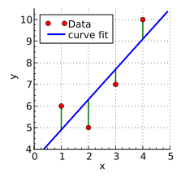
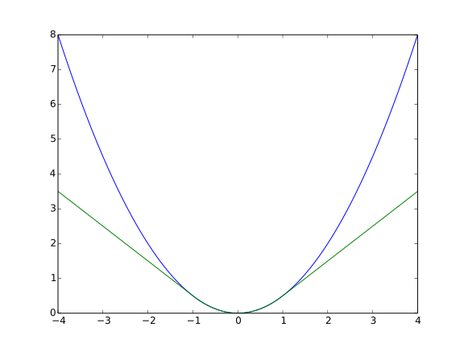

# 01. 잔차의 기하학 — MSE를 정사각형의 면적으로 보기

> 이 장의 목표 — 회귀 loss의 *수식*이 아니라 *그림*에서 무엇을 의미하는가. MSE/MAE/Huber를 한 산점도 위에 그려 보고, 각각 *어떤 도형의 합*인지를 명확히 하면 outlier 민감성 같은 직관이 즉시 이해된다.
>
> 핵심 한 줄: *도형의 크기 → 그 크기들의 평균 → loss 값 → 학습은 그 값을 최소화*. 셋은 같은 이야기의 다른 시점이다.

---

## 1.1 출발점 — 산점도와 잔차

회귀의 가장 단순한 그림은 다음이다.

- *데이터 점들* — 산점도에 흩어진 빨간 점들 $(x_i, y_i)$
- *모델 (회귀선)* — 데이터를 가로지르는 파란 직선 $\hat{y}(x) = ax + b$
- *잔차* — 각 데이터 점에서 회귀선까지의 *수직* 거리 $r_i = y_i - \hat{y}(x_i)$

**잔차 = "이 점에서 모델이 얼마나 틀렸나"**. 모델 예측 $\hat{y}_i$와 실제 정답 $y_i$의 차이. 잔차가 0이면 회귀선이 그 점을 정확히 지나간다는 뜻이고, 잔차가 크면 그 점에서 많이 빗나갔다는 뜻.



> *빨간 점: 데이터. 파란 선: 최소제곱으로 fit한 회귀선. 초록 수직 선분: 각 점의 잔차 $r_i = y_i - \hat{y}(x_i)$. 어떤 점은 회귀선 위(잔차 양수), 어떤 점은 아래(잔차 음수). 회귀의 목표는 이 잔차들의 *어떤 통계량*을 최소화하는 직선을 찾는 것.*  
> *Source: [Wikimedia Commons](https://commons.wikimedia.org/wiki/File:Linear_least_squares_example2.svg), Krishnavedala, CC BY-SA 3.0 / GFDL.*

이 그림에서 잔차는 *직선 길이*로 보인다. **MSE/MAE/Huber의 차이는 이 직선 길이를 어떤 *도형*으로 만들어 합치느냐의 차이**다 — 정사각형이냐, 직선 그대로냐, 절충 도형이냐.

---

## 1.2 MSE = 정사각형의 면적 합

MSE의 정의는:

$$L_{\text{MSE}} = \frac{1}{N} \sum_i (y_i - \hat{y}_i)^2 = \frac{1}{N} \sum_i r_i^2$$

각 잔차 $r_i$를 *제곱*해서 더한다. 기하학적으로 이건 **잔차를 한 변으로 하는 정사각형의 면적**이다.

머릿속으로 위 산점도 그림에 다음을 추가하자.

- 각 잔차 선분(초록색 수직선)을 *한 변*으로 하는 *정사각형*을 그린다.
- 정사각형이 점 옆에 매달려 있는 모습. 짧은 잔차는 작은 정사각형, 긴 잔차는 큰 정사각형.

### 단계별로 — *도형 → loss → 학습*

처음 보면 헷갈리기 쉬운 단계가 다음이다.

1. **각 점에서 도형 한 개**: 점마다 잔차 $r_i$ 만큼의 변을 가진 정사각형이 만들어진다. 이 정사각형의 *면적*은 $r_i^2$.
2. **모든 도형의 평균** = 그 정사각형 면적들을 모두 더해 N으로 나눈 값 = $\frac{1}{N}\sum_i r_i^2$. 이게 곧 **loss 값** (MSE).
3. **loss는 한 숫자**: 모델이 *전체* 데이터에 대해 얼마나 틀렸나를 압축한 단일 수치.
4. **학습 = 그 숫자를 작게**: 회귀선의 기울기·절편($a, b$)을 움직여 *그 평균 면적이 최소가 되는 위치*를 찾는다.

> 즉 *"정사각형 면적의 평균이 곧 우리가 줄이려는 값"* — 도형은 시각적 표현일 뿐, 그 면적을 모두 더해 평균 낸 값이 진짜 loss 한 개고, 학습은 그 값을 줄이는 일.

### 회귀선이 움직이면 정사각형이 어떻게 바뀌나

회귀선을 a 점에 가깝게 기울이면 *그 점의 잔차는 줄어 정사각형이 작아짐*. 하지만 동시에 *다른 점들의 잔차는 커져 그쪽 정사각형은 커짐*. 한쪽을 줄이면 다른 쪽이 커지는 trade-off.

**MSE 최소화는 모든 정사각형의 *총 면적*이 가장 작아지는 회귀선의 위치를 찾는 일**이다. 어느 한 점에 너무 가까워지지도, 너무 멀어지지도 않는 균형점.

수학적으로는 이 균형점이 정확히 *최소제곱 해* (closed-form: $w = (X^T X)^{-1} X^T y$).

### 왜 MSE는 outlier에 끌려가는가 — 수치 예시

잔차가 1인 점 100개와 잔차가 10인 점 1개가 있다고 하자.

| | 정사각형 면적 ($r^2$) | 점 수 | 면적 합 |
|---|---|---|---|
| 정상 점들 | $1^2 = 1$ | 100개 | 100 |
| Outlier 1개 | $10^2 = 100$ | 1개 | 100 |
| 총 합 | | | **200** |
| MSE = 평균 면적 | | | $200/101 \approx 2$ |

**outlier 한 점이 정상 sample 100개와 같은 비중**을 차지한다. 학습 알고리즘은 *평균 면적*을 줄이려 하니, 그 큰 정사각형을 작게 만들기 위해 회귀선이 outlier 쪽으로 기울어진다 — 그러면 정상 점들의 정사각형은 약간 커지지만, outlier의 정사각형이 100에서 80, 60으로 줄어드는 효과가 더 크기 때문.

이게 "MSE는 outlier에 매우 민감"이라는 표현의 *기하학적* 의미. 제곱이 잔차의 영향력을 *비선형적으로* 키운다 — 잔차가 10배면 면적은 100배.

---

## 1.3 MAE = 직선 길이의 합

MAE의 정의는:

$$L_{\text{MAE}} = \frac{1}{N} \sum_i |y_i - \hat{y}_i| = \frac{1}{N} \sum_i |r_i|$$

각 잔차의 *절댓값*을 더한다. 기하학적으로는 **잔차 선분의 길이를 그대로 합한 것** — 별도의 도형을 만들지 않고, 잔차 직선 자체를 길이로 본다.

위 산점도에서 *초록 수직선들의 총 길이*가 MAE에 비례. 즉 MSE처럼 정사각형을 그리는 추가 단계가 없고, 직선이 곧 loss의 구성 요소.

### 같은 outlier 예시 — MSE와 비교

| | 한 점에서 나오는 값 | 점 수 | 합 |
|---|---|---|---|
| 정상 점들 | 직선 길이 $\|r\| = 1$ | 100개 | 100 |
| Outlier 1개 | 직선 길이 $\|r\| = 10$ | 1개 | 10 |
| 총 합 | | | **110** |
| MAE = 평균 길이 | | | $110/101 \approx 1.09$ |

**outlier 한 점이 정상 sample 10개와 같은 영향**. MSE의 *1 대 100*과 비교하면 영향이 *10배 작음*. 그래서 robust — 학습 알고리즘이 outlier에 별로 끌려가지 않는다.

같은 outlier가 잔차 *10*일 때:
- **MSE 영향**: 정사각형 면적 100 → 정상 100개와 동등
- **MAE 영향**: 직선 길이 10 → 정상 10개와 동등

이게 *"잔차 영향이 제곱이냐 선형이냐"*의 직관 — 같은 잔차에 *어떤 도형*을 매다느냐에 따라 outlier 영향이 10배 차이 난다.

### 단점

- *0에서 꺾임*: 잔차가 정확히 0인 점에서 도함수가 정의되지 않아 학습 동역학이 부드럽지 못함.
- *minimizer가 중앙값*: MSE는 평균을, MAE는 중앙값을 fit한다. 분포가 한쪽으로 쏠려 있으면 평균과 중앙값이 달라 *학습 결과가 평균을 fit하지 않음*. 비즈니스 정의가 평균이면 (예: 평균 매출 예측) 부적절할 수도.

---

## 1.4 Huber = 두 도형의 절충

Huber의 정의는:

$$
L_\delta(r) =
\begin{cases}
\tfrac{1}{2} r^2 & \text{if } |r| \le \delta \\[2pt]
\delta |r| - \tfrac{1}{2}\delta^2 & \text{otherwise}
\end{cases}
$$

기하학적 해석:

- 잔차 *작으면* (|r| ≤ δ): MSE처럼 *정사각형 면적* (단 1/2 곱셈으로 부드럽게)
- 잔차 *크면* (|r| > δ): MAE처럼 *직선 길이*에 비례 (단 정사각형과 매끄럽게 이어지도록 상수 항 보정)

위 산점도에서 그림으로 표현하면:

- δ보다 짧은 잔차: 정사각형 모양
- δ보다 긴 잔차: 직선 모양

그래서 Huber는 *데이터 대부분*에서는 MSE의 부드러움을 가지고(작은 잔차 영역), *outlier*에서는 MAE의 robustness를 가진다(큰 잔차 영역).

### Loss curve로 본 Huber

잔차 길이만 보지 말고 *loss 자체의 모양*도 보자.



> *x축은 잔차 $r$, y축은 loss 값. 파란 곡선(MSE)은 잔차가 커질수록 *제곱*으로 폭발. 녹색 곡선(Huber, $\delta = 1$)은 |r| ≤ δ 구간에서 MSE와 거의 같은 부드러운 곡선이지만, |r| > δ에서는 *직선*으로 꺾인다. MAE는 이 그림에 없지만 모든 영역에서 직선 — Huber의 큰 잔차 영역과 같은 모양.*  
> *Source: [Wikimedia Commons](https://commons.wikimedia.org/wiki/File:Huber_loss.svg), Qwertyus, CC BY-SA 4.0.*

이 그림과 위 산점도 그림을 함께 머리에 두면, *왜 Huber가 절충인지*가 두 시각으로 동시에 잡힌다.

---

## 1.5 한 표로 정리

| Loss | 잔차를 어떻게 처리 | 기하학적 도형 | outlier 영향 (잔차 10) | minimizer |
|---|---|---|---|---|
| **MSE** | 제곱 $r^2$ | 정사각형 (변 = $\|r\|$) | $10^2 = 100$ | 평균 |
| **MAE** | 절댓값 $\|r\|$ | 직선 (길이 = $\|r\|$) | $10$ | 중앙값 |
| **Huber (δ=1)** | δ 안: 제곱 / δ 밖: 직선 | 정사각형(작은 r) + 직선(큰 r) | $\delta\|r\| - \frac{1}{2}\delta^2 = 9.5$ | 평균에 가까움 |

이 한 표가 §2.2의 핵심. 본문은 이 정도로 압축하고 깊은 직관은 이 페이지에서.

---

## 1.6 사고 흐름 정리 — 도형부터 학습까지

세 loss가 같은 5단계 흐름을 따른다.

```
[1] 데이터 점       │  scatter plot 위 빨간 점들
       ↓
[2] 모델(회귀선)    │  파란 직선이 점들을 가로지름
       ↓
[3] 잔차            │  각 점에서 회귀선까지 수직 거리 |r_i|
       ↓
[4] 도형            │  MSE: 정사각형 면적 r_i^2
                    │  MAE: 직선 길이 |r_i|
                    │  Huber: 절충 도형
       ↓
[5] loss = 평균     │  도형 크기들의 평균 = 한 숫자
       ↓
[6] 학습            │  회귀선 파라미터를 움직여 loss 최소화
                    │  → "도형들의 평균 크기를 가장 작게 만드는 회귀선" 찾기
```

이 6단계가 모든 회귀 loss에 공통. 차이는 **단계 4의 도형이 다르다**는 것뿐. 도형이 다르면 → 평균이 다르면 → loss 값이 다르면 → 학습 결과(회귀선의 위치)가 다르다.

**핵심 정리**: 사용자가 헷갈리기 쉬운 지점은 "도형과 loss의 관계"인데, 답은 단순:

> 도형 크기 → 그 크기들의 평균 → loss 값. 같은 이야기의 다른 시점.

그래서 *"정사각형 면적의 합이 loss"* 라고 말해도 거의 맞다 (정확히는 평균이지만 1/N 곱셈은 학습 결과에 영향 없음 — 같은 minimum).

---

## 1.7 한 줄 요약

- 회귀 loss는 *잔차를 어떤 도형으로 만들어 합치느냐*로 갈린다.
- MSE = 정사각형의 면적 합 → 큰 잔차의 영향이 *제곱*으로 폭발 → outlier 민감.
- MAE = 직선의 길이 합 → 잔차 영향이 *선형* → robust, 단 0에서 꺾임.
- Huber = δ 안에서는 정사각형, δ 밖에서는 직선 → 두 장점의 절충.
- *도형 → 평균 → loss → 최소화*가 공통 흐름. 도형만 다르다.

---

## 다음 장 (작성 예정)

- 02. Outlier sensitivity 시뮬레이션 — outlier 한 점을 움직일 때 MSE/MAE/Huber 회귀선이 얼마나 끌려가는지
- 03. Noise 모델 가정 — 가우시안 → MSE, 라플라스 → MAE의 통계적 정당성
- 04. 다변량·비선형 회귀에서 잔차 정의

---

## 본문 연결

- §2.2 MSE/MAE/Huber 정의 → 이 장이 그 시각적 직관
- §2.5 Loss 선택 사고 흐름 → §1.5 표가 빠른 참조

## 참고문헌

- Hastie, Tibshirani, Friedman. *The Elements of Statistical Learning* (2009). Chapter 3.
- Wikipedia: [Least squares](https://en.wikipedia.org/wiki/Least_squares), [Huber loss](https://en.wikipedia.org/wiki/Huber_loss)
